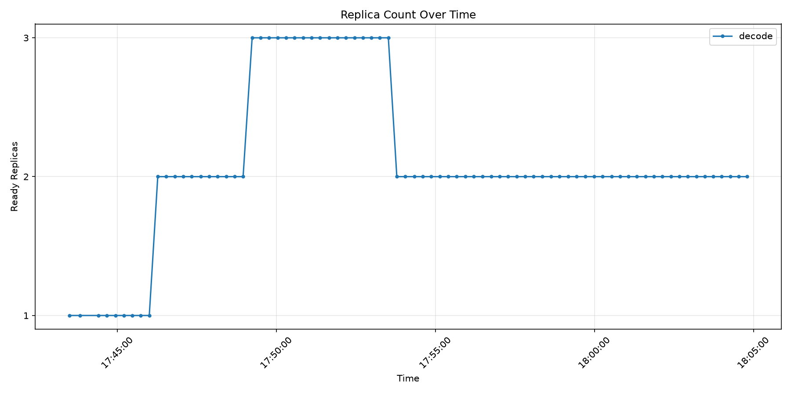
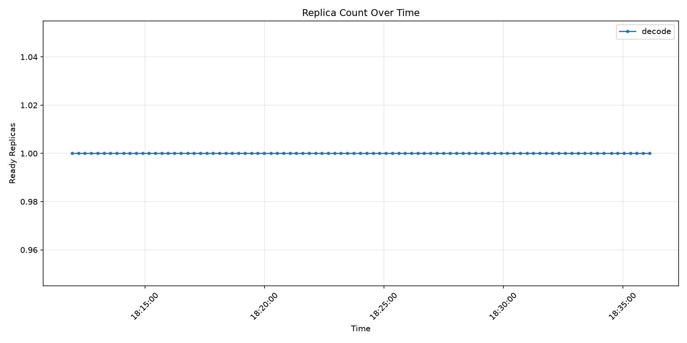
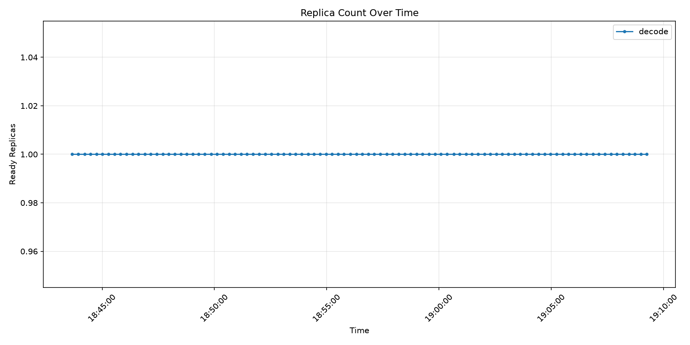
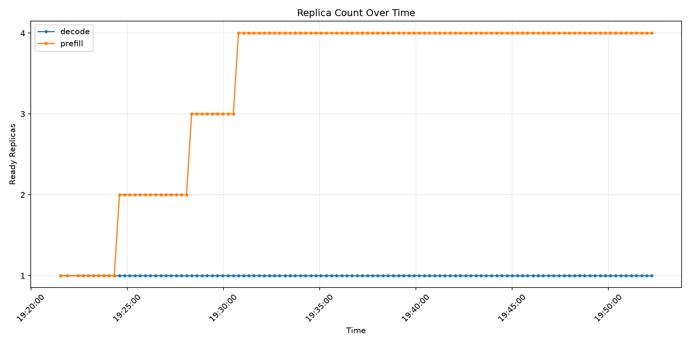
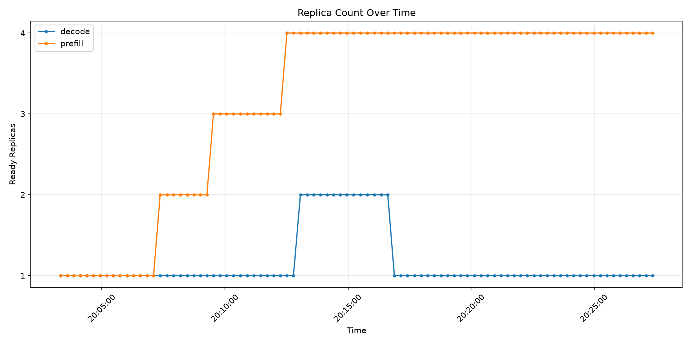
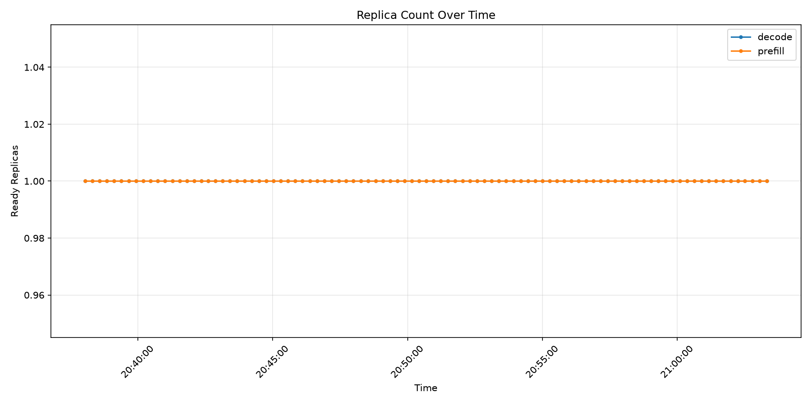

# [Experimental] Token-Aware Autoscaling

KEDA queries Prometheus directly for two signals — one EPP-emitted, one vLLM-emitted — and scales your model servers on **tokens of outstanding work** rather than a count of requests. No WVA controller, no Prometheus Adapter — just KEDA, Prometheus, and your model servers.

> [!WARNING]
> This guide is experimental and subject to change. The metrics, configurations, and APIs may evolve as the feature matures. Use in development and test environments only.

**Why tokens.** An 8192-token prompt is 16× the prefill work of a 512-token one, and a request counter rates them the same. Queue depth and running-request signals (the [keda-epp](../keda-epp/README.md) guide's queue and saturation overlays) therefore hold well when prompt sizes are homogeneous and drift when they are not: the same request rate can be a third of a replica or three replicas of prefill work. This path closes that gap by counting the tokens themselves.

## How it works

The two phases of inference are bound by different resources, so they are measured in different units and each trigger is built differently.

Three symbols recur throughout this guide:

| Symbol | Full name | What it is |
| --- | --- | --- |
| `V_P` | `peakPrefillThroughput` | Your **prefill token velocity**: how many prompt tokens one replica can prefill per second, measured on your own hardware. The one hardware-specific constant this design needs. `V` is for velocity, after the [token-velocity](#references) approach this guide follows. |
| `ISL` | input sequence length | The **uncached** prompt tokens in a request. "Uncached" matters: a prefix already in the KV cache is not prefilled again, so prefix caching lowers the effective `ISL` without changing the request. |
| `TTFT` | time to first token | How long a client waits before the first output token arrives. The latency SLO this guide's prefill threshold is derived from. |

`ISL / V_P` is therefore "seconds to prefill one request", and it turns up repeatedly below.

**Prefill is a rate problem.** The EPP publishes the tokens it has dispatched to each endpoint but not yet finished prefilling. Dividing that backlog by **`peakPrefillThroughput`** converts tokens into **seconds of queue wait**, which is directly comparable to a share of your time-to-first-token (TTFT) budget:

```text
replicas = ceil(  queued_tokens ÷ peakPrefillThroughput  ÷  threshold  )
                 └──── converts tokens → seconds ────┘   └ seconds of queue budget ┘
```

`peakPrefillThroughput` is **not** the KEDA threshold. It lives inside the PromQL, where it is a unit conversion; the threshold is the number of seconds of backlog you are willing to tolerate per replica. KEDA has no arithmetic of its own, which is why the division has to be in the query.

**Decode is an occupancy problem.** It has no equivalent measured rate. `vllm:kv_cache_usage_perc` is already a fraction of capacity, so the threshold is compared against it directly and the unit is "pods' worth of full KV cache". When a pod's KV cache fills, vLLM stops admitting requests outright, so you act before that — `0.8` means "act at 80 % full".

### The two topologies

| | [P+D co-located](./optimized-baseline/) | [P/D-disaggregated](./pd-disaggregation/) |
| --- | --- | --- |
| **Base guide** | [optimized-baseline](../../optimized-baseline/README.md) | [pd-disaggregation](../../pd-disaggregation/README.md) |
| **Objects** | one `ScaledObject`, two triggers, one Deployment | one `ScaledObject` per role, two Deployments |
| **Scaling rule** | `max(ceil(backlog_s / 1.5), ceil(kv / 0.8))` — the current bottleneck wins | prefill and decode scale independently |
| **Trade-off** | simpler: one calibration, one object. A prompt-heavy burst and a generation-heavy burst both scale the whole pod | tracks lopsided load between phases, at the cost of two objects and a calibration through the KV-transfer path |

The token math is identical across both. Only the query *shape* (role selectors) and the *number* of `ScaledObject`s differ.

## Metrics

| Metric | Type | Description | Labels used |
| --- | --- | --- | --- |
| `llm_d_epp_inflight_tokens` | Gauge | Uncached prompt tokens dispatched to an endpoint but not yet prefilled — the prefill backlog. | `namespace`, `producer_name`, `endpoint_name` |
| `vllm:kv_cache_usage_perc` | Gauge | Per-pod KV cache occupancy (0.0–1.0). | `namespace`, `pod` |

For details on these metrics, see:

- [EPP Request Handling Metrics](../../../docs/architecture/core/router/epp/request-handling.md)
- [EPP Scheduling Metrics](../../../docs/architecture/core/router/epp/scheduling.md)
- [Metric reference](../../../docs/operations/observability/metrics.md) and [PromQL reference](../../../docs/operations/observability/promql.md)

### Endpoint-removal note for older EPP images

`llm_d_epp_inflight_tokens` is a `GaugeVec` whose series were historically **not pruned when an endpoint was removed**, so a scaled-down pod left a series frozen at its last non-zero value and `sum()` could never fall back — the fleet would scale up but not down. That was [llm-d-router#2529](https://github.com/llm-d/llm-d-router/issues/2529), **fixed by [llm-d-router#2577](https://github.com/llm-d/llm-d-router/pull/2577)**, and the plain `sum()` queries in this guide rely on that fix.

The fix is on `main`, the Router Helm chart's default EPP image tag, but it merged after `v0.10.0`, so it is **not in a tagged release yet**. If you set `router.epp.image.tag` to `v0.10.0` or earlier and see prefill scale up but never back down, either move to `main` or intersect the numerator against a metric that *is* rebuilt from live endpoints each scrape, which filters the stale series out:

```promql
    label_replace(llm_d_epp_inflight_tokens{...}, "target_pod", "$1", "endpoint_name", "(.+)")
  and on (target_pod)
    label_replace(llm_d_epp_per_endpoint_queue_size{name="<your-pool>"},
                  "target_pod", "$1", "model_server_endpoint", "(.+)")
```

`and on (...)` is a set intersection, not arithmetic — it contributes no value, only liveness. The two `label_replace` calls are plumbing, because the metrics label the same pod as `endpoint_name` and `model_server_endpoint` respectively.

## Prerequisites

Before proceeding, ensure you have:

1. **Monitoring stack with Prometheus over HTTPS** — See [autoscaling prerequisites](../README.md#prerequisites) and [Prometheus Setup Guide](../../../docs/operations/observability/setup.md). This includes KEDA installation. The decode trigger additionally needs the model servers scraped, so apply your base guide's monitoring component (`recipes/modelserver/components/monitoring`, or `monitoring-pd` for P/D) — without it `vllm:kv_cache_usage_perc` never reaches Prometheus and that trigger reads 0 forever.

2. **A deployed base guide** — complete either the [optimized-baseline guide](../../optimized-baseline/README.md) (P+D co-located) or the [pd-disaggregation guide](../../pd-disaggregation/README.md) (P/D-disaggregated), and set `TOPOLOGY` below to match.

3. **The EPP plugins that emit the prefill signal** — `inflight-load-producer` (publishes `llm_d_epp_inflight_tokens`) and `prefix-cache-affinity-filter` (carries `peakPrefillThroughput`). **Both base guides already register these in their shipped router values**, so no EPP change is required beyond step 4. If you built your own router config, add them.

   > [!NOTE]
   > Keep the EPP at a single replica. The `inflight-load-producer`'s token accounting is local to each EPP process, so multiple replicas would each see — and publish — only a fraction of the per-endpoint load. The `pd-disaggregation` router values pin `replicas: 1` for this reason.

4. **A calibrated `peakPrefillThroughput`** — this is the one hardware-specific constant the design needs, and the shipped values are reference figures (`15928` for Qwen3-32B / H100-80GB / TP=2; `33821` for the P/D guide's gpt-oss-120b / H200 fleet). Measure your own:

<!-- guide:prerequisites.calibration start -->
```bash
GUIDE_NAME=${TOPOLOGY} \
NAMESPACE=${NAMESPACE} \
MODEL_NAME=${MODEL} \
CHUNK_SIZE=8192 \
${REPO_ROOT}/guides/recipes/router/calibration/calibrate.sh
```
<!-- guide:prerequisites.calibration end -->

   `calibrate.sh` computes `V_P = CHUNK_SIZE / median(TTFT)` on an idle stack and **only prints** the value — see the [calibration guide](../../recipes/router/calibration/README.md) and the [configuration matrix](../../recipes/router/calibration/configuration-matrix.md). Because TTFT is time-to-*first*-token, the figure already includes the KV transfer to decode and the first decode step on the P/D path. `CHUNK_SIZE` must match vLLM's effective `--max-num-batched-tokens` or the result is silently wrong.

   Measure through the path you will serve on. Do not borrow a published figure: the same GPU and model measured through a P/D path with a slow KV fabric can be several times slower than on the aggregated path, and the divisor changes when prefill scales — one reference stack asked for 8 replicas at `V_P = 2696` and 3 at `V_P = 15928` under identical load.

## Set Namespaces

Set the guide environment variables:

<!-- guide:env.static start -->
```bash
export BRANCH=main
export REPO_ROOT=$(realpath $(git rev-parse --show-toplevel))
export NAMESPACE=llm-d-optimized-baseline # options: llm-d-optimized-baseline, llm-d-pd-disaggregation
export MONITORING_NAMESPACE=llm-d-monitoring
export MODEL=Qwen/Qwen3-32B
export ENV=existing # options: existing, ocp
export TOPOLOGY=optimized-baseline # options: optimized-baseline, pd-disaggregation
export OVERLAY_ROOT=${REPO_ROOT}/guides/workload-autoscaling/keda-epp-token-aware/${TOPOLOGY}
```
<!-- guide:env.static end -->

Source the common guide environment variables:

<!-- guide:env.source start -->
```bash
source ${REPO_ROOT}/guides/env.sh
```
<!-- guide:env.source end -->

## Configure

### 1. Create TriggerAuthentication Secret (generic Kubernetes only)

> On **OpenShift**, skip this step — the `ocp` overlay provisions a dedicated
> ServiceAccount and token Secret automatically (see [OpenShift](#openshift) below).

For the bundled kube-prometheus-stack on generic Kubernetes, KEDA needs a bearer token and CA certificate to authenticate with Prometheus. Extract these from the Prometheus ServiceAccount's auto-generated token secret and create a new `prometheus-token` secret in the workload namespace:

<!-- guide:deploy.prometheus_auth start -->
```bash
# only when ENV=existing:
SERVICEACCOUNT_SECRET=$(kubectl get serviceaccount prometheus -n ${MONITORING_NAMESPACE} -o jsonpath='{.secrets[0].name}')
TOKEN=$(kubectl get secret ${SERVICEACCOUNT_SECRET} -n ${MONITORING_NAMESPACE} -o jsonpath='{.data.token}' | base64 -d)
CA_CRT=$(kubectl get secret ${SERVICEACCOUNT_SECRET} -n ${MONITORING_NAMESPACE} -o jsonpath='{.data.ca\.crt}' | base64 -d)
kubectl create secret generic prometheus-token \
  --from-literal=token="${TOKEN}" \
  --from-literal=ca.crt="${CA_CRT}" \
  --dry-run=client -o yaml | kubectl apply -f - -n ${NAMESPACE}
```
<!-- guide:deploy.prometheus_auth end -->

This creates a secret named `prometheus-token` containing:

- `token`: bearer token for Prometheus authentication
- `ca.crt`: CA certificate for TLS verification

### 2. Set your calibrated `peakPrefillThroughput`

The value measured in Prerequisites step 4 goes in **two places**, and they are read by different components:

| Where | Read by | Effect |
| --- | --- | --- |
| `prefix-cache-affinity-filter.parameters.peakPrefillThroughput` in your guide's router values | the EPP router | prices recomputing a prompt against reusing a cached prefix when picking a pod |
| the `/ <V_P>` divisor in this overlay's prefill query | the KEDA trigger | converts queued tokens into seconds of backlog |

For the router side, edit your base guide's router values file and re-apply, then restart the EPP:

```bash
kubectl rollout restart -n ${NAMESPACE} deployment/${TOPOLOGY}-epp
```

For the trigger side, edit the divisor in the overlay's `scaledobject.yaml` (`optimized-baseline/base/scaledobject.yaml`, or `pd-disaggregation/base/prefill-scaledobject.yaml`). Kustomize cannot reach inside a PromQL string, so this — like the label selectors — is a hand edit.

### 3. Apply the ScaledObject(s) and TriggerAuthentication

On generic Kubernetes with the bundled kube-prometheus-stack, apply the `k8s` overlay:

<!-- guide:deploy.apply_k8s start -->
```bash
# only when ENV=existing:
kubectl apply -k ${OVERLAY_ROOT}/k8s -n ${NAMESPACE}
```
<!-- guide:deploy.apply_k8s end -->

On OpenShift, apply the `ocp` overlay instead (see [OpenShift](#openshift) — it handles authentication for you):

<!-- guide:deploy.apply_ocp start -->
```bash
# only when ENV=ocp:
kubectl apply -k ${OVERLAY_ROOT}/ocp -n ${NAMESPACE}
```
<!-- guide:deploy.apply_ocp end -->

Before applying, edit the manifests to match your deployment:

- **the `/ <V_P>` divisor** in the prefill query — your calibrated figure (step 2)
- **`namespace`** in every query, to your deployment's namespace. Both queries pin it: on a cluster-wide store (OpenShift Thanos, or any Prometheus scraping several namespaces) an unpinned query silently aggregates every EPP on the cluster, so a shared-cluster deployment would scale on other tenants' traffic
- **the `.*prefill.*` / `.*decode.*` selectors** (P/D overlay only) if your Deployments are named differently
- **`threshold`** on each trigger — see [Choosing the two thresholds](#choosing-the-two-thresholds)
- **`minReplicaCount`, `maxReplicaCount`**
- **`serverAddress`** in every trigger, if your Prometheus is not the bundled llm-d stack

### Choosing the two thresholds

#### Prefill: seconds of queue budget, from your TTFT SLO

The prefill threshold is **not measured from anything**. It is the share of your time-to-first-token budget you are willing to spend waiting in the prefill queue — the budget left after the irreducible floor of your workload (`V_P`, `ISL` and `TTFT` are defined under [How it works](#how-it-works)):

```text
threshold ≈ TTFT_SLO − (ISL_uncached / V_P)        [seconds]
            └ product target ┘  └ the idle floor ┘
```

**The idle floor is the TTFT you get when nothing is queued** — one request alone on an unloaded stack. It is the time the pod needs to actually prefill that prompt, and no amount of scaling removes it: adding replicas shortens the *line*, never the work at the front of it. So the floor is what your SLO pays first, and the threshold is whatever is left over.

`ISL/V_P` **is** the whole idle TTFT for that prompt — `V_P` was measured as `CHUNK_SIZE / median(TTFT)` through the router, and TTFT already contains the KV transfer and the first decode step, so do not add a transfer term or you double-count. Autoscaling removes *queueing*; it can never take you below this floor. If `TTFT_SLO ≤ floor`, no threshold meets it — raise `V_P` (faster accelerators, larger prefill chunk) or shrink the *uncached* ISL (prefix caching) instead of scaling.

Worked against three workload shapes at two very different values of `V_P`, to show how much the constant matters. Both `V_P` columns are real calibrations of the same model class: **15928 tok/s** is the plugin's shipped default (Qwen3-32B on H100-80GB, TP=2, measured on the aggregated path), and **2696 tok/s** was measured on comparable hardware through a P/D path, where TTFT also pays the KV transfer to the decode pod. Every cell is the same two steps — `floor = ISL / V_P`, then `threshold = SLO - floor` — so only the constant changes:

| workload | ISL | idle floor at `V_P` = 2696 tok/s | idle floor at `V_P` = 15928 tok/s | example TTFT SLO | threshold at `V_P` = 2696 | threshold at `V_P` = 15928 |
| --- | --- | --- | --- | --- | --- | --- |
| prefill-heavy | 8192 | 3.04 s | 0.51 s | 8 s | **~5.0 s** | **~7.5 s** |
| symmetrical | 2048 | 0.76 s | 0.13 s | 3 s | **~2.2 s** | **~2.9 s** |
| decode-heavy | 256 | 0.09 s | 0.02 s | trivially met | prefill moot — **decode KV governs** | prefill moot — **decode KV governs** |

Every cell above is two divisions and a subtraction. Spelled out for the prefill-heavy row:

```text
                    V_P = 2696                  V_P = 15928
floor     = ISL/V_P    8192 / 2696 = 3.04 s       8192 / 15928 = 0.51 s
threshold = SLO-floor  8 - 3.04    = 4.96 s       8 - 0.51     = 7.49 s
                                   ≈ 5.0 s                     ≈ 7.5 s
```

The thresholds are rounded to one decimal because the SLO they come from is itself a judgement call — carrying 4.96 would imply precision the input does not have.

The same workload against the same SLO wants a threshold 50 % apart across those two columns. That is the argument for calibrating `V_P` on your own serving path rather than borrowing a published figure.

Two adjustments before committing a number:

- **Tail, not mean.** `metricType: AverageValue` makes the signal a per-replica *average*, so roughly half of requests wait longer than the threshold. For a p90/p99 SLO, shave to ~60–70 % of the formula result.
- **Serving margin.** The calibrated floor is a median on an idle stack; real serving runs higher. One reference cluster measured 4.2 s mean TTFT against a 3.0 s calibrated floor at low rate.

The shipped `1.5` suits interactive / short-context traffic (small ISL, ~2 s SLO). Lower it to scale earlier and hold more prefill pods; raise it to tolerate more queueing and run leaner. Being a little off costs slower first tokens, not failures — prefill latency degrades gradually.

#### Decode: how much KV headroom you keep

`0.8` is compared directly against occupancy and means "act at 80 % full". Lower it for more margin, raise it to run hotter. Unlike prefill, the failure mode here is abrupt: past a full cache vLLM refuses admission, and because decode holds each request for its whole generation, the fleet recovers a full generation-time *behind* the traffic.

### How offered load becomes a replica count

At `V_P = 2696` tok/s with every request at ISL 8192, one replica retires `V_P ÷ ISL = 0.33` req/s of prefill, and load in replica-equivalents is `(r × 8192) ÷ 2696`:

| rate `r` (req/s) | tokens/s | replica-equivalents | `ceil(÷ 1.5)`, cap 4 |
| --- | --- | --- | --- |
| 0.15 | 1229 | 0.46 | 1 |
| 0.30 | 2458 | 0.91 | 1 |
| 0.50 | 4096 | 1.52 | 2 ← the knee |
| 1.40 | 11469 | 4.25 | 4 (at cap, real backlog builds) |

The knee lands where the math predicts: 0.50 req/s is the first stage past one replica's 0.33 req/s ceiling. Note that the trigger does not watch offered rate — it watches *measured* backlog, so observed replicas can lead this table during a transient.

> [!IMPORTANT]
> This table assumes **open-loop** arrivals — a request rate that continues regardless of how fast the pool answers. Under **closed-loop** load, where a fixed number of clients each wait for a reply before sending again, `inflight_tokens` settles at `concurrency × ISL` and is *invariant to capacity*: adding replicas does not reduce it, because the clients simply get served faster and immediately re-send.
>
> The prefill trigger then climbs to `maxReplicaCount` by construction and stays there for as long as the load runs. That is the load generator's behaviour, not a stuck metric — check that per-endpoint `inflight_tokens` values are evenly spread to confirm the series are live. Size the ramp against offered *rate* if you want the replica counts above to be reproducible.

### Platform-specific notes

#### Generic Kubernetes with an unauthenticated Prometheus

The `k8s` overlay assumes the bundled kube-prometheus-stack, which serves HTTPS and requires a bearer token — hence Configure step 1 and the `TriggerAuthentication`. If your Prometheus is reachable over plain HTTP with no auth (a common in-cluster development setup), that machinery has nothing to do: **skip Configure step 1**, then drop the `authenticationRef` block from each trigger and remove `triggerauthentication.yaml` from the base, e.g. from your own overlay:

```yaml
patches:
  - patch: |-
      - op: remove
        path: /spec/triggers/1/authenticationRef
      - op: remove
        path: /spec/triggers/0/authenticationRef
    target:
      kind: ScaledObject
  - patch: |-
      $patch: delete
      apiVersion: keda.sh/v1alpha1
      kind: TriggerAuthentication
      metadata:
        name: prometheus-auth
```

Remove the higher trigger index first — a JSON Patch is applied in order, and removing index 0 first renumbers the list. Also update `serverAddress` to your `http://` endpoint.

#### OpenShift

On OpenShift, apply the `ocp` overlay (skip Configure step 1 — this overlay handles authentication for you):

```bash
kubectl apply -k ${OVERLAY_ROOT}/ocp -n ${NAMESPACE}
```

The overlay:

- Points every trigger at `thanos-querier.openshift-monitoring.svc.cluster.local:9091` and enables `authModes: bearer`. Thanos rejects unauthenticated queries with a 401, and KEDA silently serves `fallback` replicas when a trigger errors, so unauthenticated autoscaling looks healthy while doing nothing.
- Provisions a dedicated `keda-epp-metrics-reader` ServiceAccount granted the `cluster-monitoring-view` ClusterRole, and repoints the `TriggerAuthentication` at that SA's token Secret. On OpenShift the service-ca operator injects `service-ca.crt` (the CA that signs Thanos's serving certificate) into the token Secret automatically, so no `prometheus-token` copy is required.
- Renames the `cluster-monitoring-view` ClusterRoleBinding per namespace. The binding is cluster-scoped and the recipe is shared with the `keda-epp` guide's overlays, so a fixed name would collide across namespaces or guides. If you deploy to a namespace other than the overlay's default, update that patch too.

## Verify

Check that the ScaledObject(s) are ready and KEDA has created its HPA:

<!-- guide:verify.tests.scaledobject_hpa start -->
```bash
kubectl get scaledobject -n ${NAMESPACE}
kubectl wait --for=condition=Ready scaledobject --all -n ${NAMESPACE} --timeout=120s
kubectl get hpa -n ${NAMESPACE}
```
<!-- guide:verify.tests.scaledobject_hpa end -->

Expected output on the P+D co-located topology (one ScaledObject; P/D yields two, one per role). Columns are as KEDA 2.20 prints them, trimmed here to the ones that carry the result:

```text
NAME                                             SCALETARGETNAME                             MIN  MAX  READY  ACTIVE  FALLBACK  PAUSED  TRIGGERS    AGE
optimized-baseline-nvidia-gpu-vllm-token-aware   optimized-baseline-nvidia-gpu-vllm-decode   1    10   True   False   False     False   prometheus  1m

NAME                                                      REFERENCE                                              TARGETS                        MINPODS  MAXPODS  REPLICAS  AGE
keda-hpa-optimized-baseline-nvidia-gpu-vllm-token-aware   Deployment/optimized-baseline-nvidia-gpu-vllm-decode   0/1.500 (avg), 0/800m (avg)    1        10       1         1m
```

`ACTIVE` is `False` while the pool is idle — it flips to `True` once a trigger passes its `activationThreshold`. The two `TARGETS` pairs are the prefill and decode triggers in declaration order.

> [!NOTE]
> KEDA creates its own HPA object from the ScaledObject. Do **not** apply a separate `hpa.yaml` — doing so will cause conflicts.

`Ready=True` only proves the scaler *config* parses. Confirm the queries actually resolve — a trigger that errors is suppressed by KEDA, which then serves `fallback` replicas while looking healthy:

<!-- guide:verify.tests.trigger_metrics start -->
```bash
kubectl get hpa -n ${NAMESPACE} -o jsonpath='{range .items[*]}{.metadata.name}{"\t"}{range .status.conditions[?(@.type=="ScalingActive")]}{.status}{" "}{.reason}{end}{"\n"}{end}'
kubectl get hpa -n ${NAMESPACE}
```
<!-- guide:verify.tests.trigger_metrics end -->

Every HPA should report `True ValidMetricFound`, and every `TARGETS` pair should show a **number** on the left:

```text
0/1.500 (avg), 0/800m (avg)                    <- healthy: queries resolve, pool idle
<unknown>/1.500 (avg), <unknown>/800m (avg)    <- broken: the query is not resolving
```

That distinction is the one worth internalising. `0` means the query ran and the pool is quiet; `<unknown>` means KEDA could not evaluate the trigger at all — a 401 from Thanos, a mistyped label, a metric that does not exist — and KEDA reports the failure only as an HPA condition while serving `fallback` replicas. `kubectl describe hpa -n ${NAMESPACE}` prints the same pair under `Metrics:` alongside the `ScalingActive` message if you need the underlying error.

Responsiveness is governed by the HPA's sync period (`--horizontal-pod-autoscaler-sync-period`, 15 s by default), not by a `pollingInterval` on the ScaledObject: KEDA honours that field only when it owns activation or caching — `minReplicaCount: 0`, `idleReplicaCount: 0`, or a trigger with `useCachedMetrics`. Setting it otherwise is inert and makes KEDA 2.20 warn on every apply, so these overlays omit it. Use the `behavior` block to change how fast replicas are added or removed; if you set `minReplicaCount: 0` to scale to zero, `pollingInterval` starts mattering and should be set deliberately.

## Benchmarking

Qwen/Qwen3-32B on H100-80GB, vLLM v0.30.0, EPP v0.11.0. P+D: TP=2. P/D: prefill TP=1, decode TP=2. Every run uses a fresh, calibrated stack and the shipped profile rates. Each shape is compared across three modes:

- **Autoscaled:** starts at 1 replica per role and scales up to `maxReplicas: 4` on the token-aware triggers.
- **Under-provisioned:** no ScaledObject, fixed at 1 replica per role. Cheap, but it can't absorb a burst.
- **Over-provisioned:** no ScaledObject, fixed at 4 replicas per role, the same cap as the autoscaler's `maxReplicas`. Both modes have the same maximum capacity: over-provisioned pays for it all the time, autoscaled only while the load needs it. This is the common way to protect latency without an autoscaler.

| Topology | Shape (ISL/OSL) | Mode | Replicas (start → peak) | Peak GPUs | GPU-hours | TTFT p50 | TTFT p99 | Completed / total | Output tok/s |
| --- | --- | --- | --- | --- | --- | --- | --- | --- | --- |
| P+D | prefill-heavy (8192/256) | Under-provisioned | 1 | 2 | 0.78 | 225 s | 470 s | 2316 / 2316 | 510 |
| | | **Autoscaled** | 1 → 3 | 6 | **1.74** | **0.62 s** | 43.8 s | 2307 / 2316 | 572 |
| | | Over-provisioned | 4 | 8 | 3.11 | 0.61 s | 6.4 s | 2316 / 2316 | 594 |
| P+D | symmetrical (2048/2048) | Under-provisioned | 1 | 2 | 0.85 | 0.21 s | 0.41 s | 1248 / 1248 | 1984 |
| | | **Autoscaled** | 1 | 2 | **0.85** | 0.20 s | 0.43 s | 1248 / 1248 | 1885 |
| | | Over-provisioned | 4 | 8 | 3.39 | 0.19 s | 0.22 s | 1248 / 1248 | 1988 |
| P+D | decode-heavy (256/4096) | Under-provisioned | 1 | 2 | 0.91 | 0.09 s | 0.13 s | 624 / 624 | 1856 |
| | | **Autoscaled** | 1 | 2 | **0.91** | 0.09 s | 0.13 s | 624 / 624 | 1785 |
| | | Over-provisioned | 4 | 8 | 3.66 | 0.09 s | 0.13 s | 624 / 624 | 1928 |
| P/D | prefill-heavy (8192/256) | Under-provisioned | P 1, D 1 | 3 | 1.65 | 303 s¹ | 592 s¹ | 116 / 2316 | 20 |
| | | **Autoscaled** | P 1 → 4, D 1 | 6 | **3.06** | 439 s¹ | 593 s¹ | **818** / 2316 | **135** |
| | | Over-provisioned | P 4, D 4 | 12 | 6.58 | 302 s¹ | 588 s¹ | 656 / 2316 | 127 |
| P/D | symmetrical (2048/2048) | Under-provisioned | P 1, D 1 | 3 | 1.32 | 282 s | 536 s | 1248 / 1248 | 1353 |
| | | **Autoscaled** | P 1 → 4, D 1 → 2 | 8 | **2.62** | 1.97 s | 150 s | 1233 / 1248 | 1888 |
| | | Over-provisioned | P 4, D 4 | 12 | 5.27 | 1.68 s | 3.2 s | 1248 / 1248 | 2051 |
| P/D | decode-heavy (256/4096) | Under-provisioned | P 1, D 1 | 3 | 1.37 | 0.27 s | 0.45 s | 624 / 624 | 1950 |
| | | **Autoscaled** | P 1, D 1 | 3 | **1.37** | 0.33 s | 0.58 s | 624 / 624 | 1790 |
| | | Over-provisioned | P 4, D 4 | 12 | 5.47 | 0.28 s | 0.36 s | 624 / 624 | 1933 |

¹ Over completed requests only. GPU-hours for autoscaled runs come from the replica count every 30 s; for static runs they are the fixed GPU count × the same run length.

Measured `peakPrefillThroughput`: P+D 15375–15988. P/D 1154–1450.

**Autoscaled vs over-provisioned:**

| | P+D prefill-heavy | P+D symmetrical | P+D decode-heavy | P/D prefill-heavy | P/D symmetrical | P/D decode-heavy |
| --- | --- | --- | --- | --- | --- | --- |
| GPU-hours saved | **44%** | **75%** | **75%** | **53%** | **50%** | **75%** |
| TTFT p50 difference | +0.01 s | +0.01 s | 0 | not comparable² | +0.29 s | +0.05 s |

² Both modes are capped at 4 prefill replicas and time out most requests (818 vs 656 completed), so their TTFT values cover different sets of requests.

**How to read:**

- **Same median latency, half the GPUs or less.** Autoscaling stays within 0.3 s of over-provisioned TTFT p50 while using 44–75% fewer GPU-hours, because it adds replicas only while the load needs them.
- **Light traffic is where over-provisioning wastes most.** P+D symmetrical, P+D decode-heavy and P/D decode-heavy fit on 1 replica per role. The extra GPUs sit idle, and autoscaling saves 75% at the same TTFT.
- **The trade-off is tail latency during the ramp-up.** On a burst, autoscaling adds 1 pod every 180 s, so p99 is higher while it catches up (P+D prefill-heavy 43.8 s vs 6.4 s, P/D symmetrical 150 s vs 3.2 s). A more aggressive `scaleUp` policy narrows that gap.
- **Compared with under-provisioning, autoscaling is what keeps bursts usable.** P+D prefill-heavy p50 goes from 225 s to 0.62 s, and P/D symmetrical from 282 s to 1.97 s.
- **The cap binds both modes.** P/D prefill-heavy needs more than 4 prefill replicas at the shipped rate. Autoscaled and over-provisioned hit the same 4-replica cap, so over-provisioning has no capacity edge there. All failures in both are 600 s client timeouts. Raise `maxReplicas` (and the over-provisioned replica count) or lower the rate.

| | prefill-heavy | symmetrical | decode-heavy |
| --- | --- | --- | --- |
| P+D |  |  |  |
| P/D |  |  |  |

### Reproduce

Uses [`llm-d-benchmark`](https://github.com/llm-d/llm-d-benchmark) at `9415d5e1`:

```bash
curl -sSL https://raw.githubusercontent.com/llm-d/llm-d-benchmark/main/install.sh | bash
cd llm-d-benchmark && git checkout 9415d5e1 && source .venv/bin/activate

SPEC=guides/keda-epp-token-aware                     # P+D
# SPEC=guides/keda-epp-token-aware-pd-disaggregation # P/D

for SHAPE in prefill_heavy symmetrical decode_heavy; do
  llmdbenchmark --spec ${SPEC} standup -p ${NAMESPACE}
  make calibrate-peak-prefill NAMESPACE=${NAMESPACE} APPLY=1
  llmdbenchmark --spec ${SPEC} --workspace results/${SHAPE} run -p ${NAMESPACE} \
    --harness inference-perf --workload random_${SHAPE}.yaml --monitoring --analyze
  llmdbenchmark --spec ${SPEC} teardown -p ${NAMESPACE}
done
```

For under-provisioned, add `--set=eppKedaSaturation.enabled=false` to `standup`, `run` and `teardown`. For over-provisioned, also add `--set=decode.replicas=4`, plus `--set=prefill.replicas=4` for P/D, and pass `--modelservice-deploy-timeout 3600` to `standup`: 4 replicas loading the model at once can exceed the default readiness wait. On OpenShift, pass a `--cluster-config` from `config/cluster-configs/examples/` to all three. Charts are written to `results/${SHAPE}/latest/analysis/*/graphs/replica_status.png`.

### Sizing

Decode runs at TP=2: Qwen3-32B weights (~64 GB) on TP=1 leave ~12 GB of KV cache (~48k tokens), while TP=2 leaves ~88 GB (~350k tokens). Prefill runs at TP=1, so each extra prefill replica costs one GPU.

To change TP, add these overrides to the loop's `standup`. GPU requests follow `tensor`. `prefill.*` applies to P/D only.

```bash
llmdbenchmark --spec ${SPEC} standup -p ${NAMESPACE} \
  --set prefill.parallelism.tensor=2 \
  --set decode.parallelism.tensor=4 \
  --set eppKedaSaturation.scaledObject.maxReplicas=2
```

- `peakPrefillThroughput` depends on prefill TP. The loop's `calibrate-peak-prefill` step re-measures it.
- Peak GPUs = `maxReplicas` × TP (P+D), or `maxReplicas` × (prefill TP + decode TP) (P/D). Lower `maxReplicas` to fit your GPU budget.
- The thresholds (`1.5` s, `0.8`) are per replica and don't change with TP.

## Cleanup

<!-- guide:cleanup start -->
```bash
# only when ENV=existing:
kubectl delete -k ${OVERLAY_ROOT}/k8s -n ${NAMESPACE} --ignore-not-found=true

# only when ENV=ocp:
kubectl delete -k ${OVERLAY_ROOT}/ocp -n ${NAMESPACE} --ignore-not-found=true

# only when ENV=existing:
kubectl delete secret prometheus-token -n ${NAMESPACE} --ignore-not-found=true
```
<!-- guide:cleanup end -->

## References

The token-velocity approach — sizing each role by dividing a token rate by that role's token throughput, so prefill and decode share a common denominator in tokens/s — follows:

> Ruiqi Lai, Hongrui Liu, Chengzhi Lu, Zonghao Liu, Siyu Cao, Siyang Shao, Yixin Zhang, Luo Mai, and Dmitrii Ustiugov. **"TokenScale: Timely and Accurate Autoscaling for Disaggregated LLM Serving with Token Velocity."** arXiv:2512.03416 [cs.DC], December 2025. <https://arxiv.org/abs/2512.03416>
