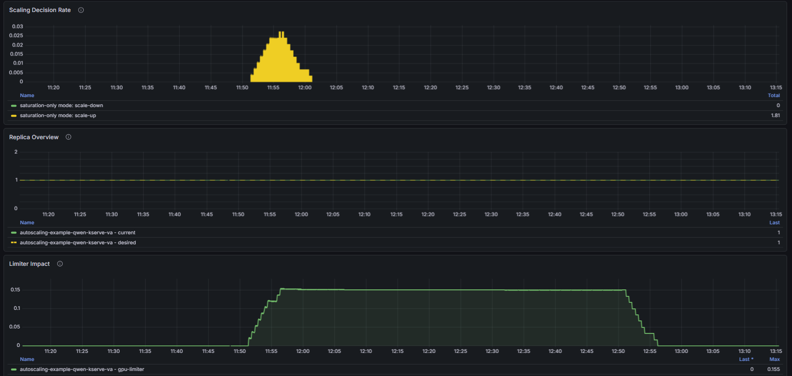

# Scaling Limiter
WVA can issue signals to scale up a variant. However, if there are not sufficient GPUs in the cluster, then instead of having scaled-up replicas being in `pending` state waiting for GPUs, you can enable this scaling limiter feature so that WVA doesn't issue scale up signals if there are not enough GPUs in the cluster - avoiding having many replicas in `pending` state.

## Enable Limiter
This feature is disable by default. To enable this feature, edit the configmap below and set `enableLimiter` to `true`:
  ```bash
  kubectl get cm -n redhat-ods-applications workload-variant-autoscaler-saturation-scaling-config -o yaml

  apiVersion: v1
  data:
    default: |
      ...
      queueSpareTrigger: 1
      # Enable GPU limiter to constrain scaling based on available cluster resources
      # When true, scale-up decisions are limited by available GPU capacity
      enableLimiter: true
  ```

## Monitor Limiter In WVA Dashboard
Assume that WVA Grafana dashboard is enabled, the following charts show this feature when enabled. In this example, the cluster only has 1 H100 GPU. The `Scaling Decision Rate` panel shows `scale-up` decisions, but the `Replica Overview` panel shows the number of replica stays at 1 due to the limiter as shown in `Limiter Impact` panel. You can get detailed descriptions of the charts on the panels by hovering over the `i` icons:

[](limiter.png)