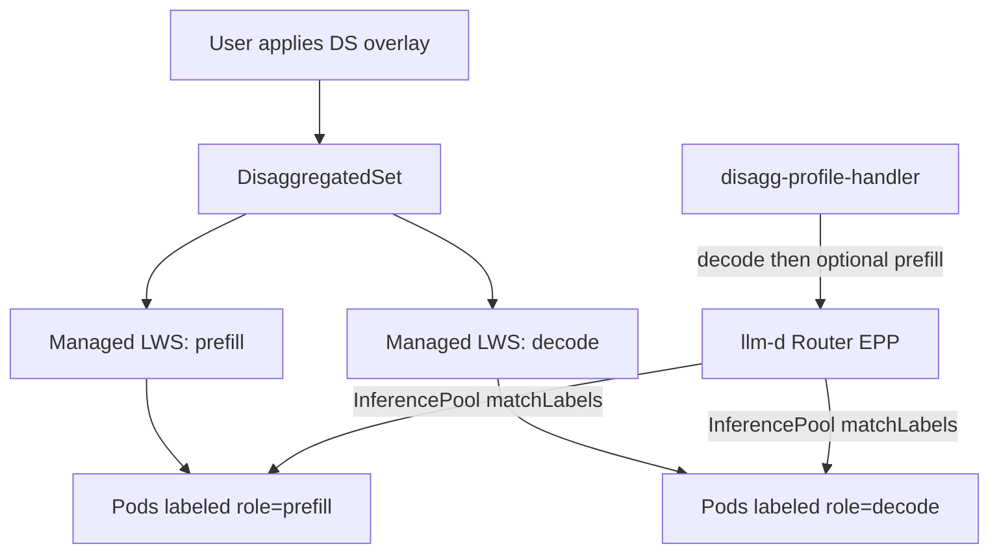

# Gradual Adoption of LWS DisaggregatedSet for P/D Workloads

## Summary

This proposal introduces the Kubernetes SIG-LWS `DisaggregatedSet` API as an
optional deployment path for llm-d prefill/decode workloads that currently use
multiple independent `LeaderWorkerSet` resources.

`DisaggregatedSet` is still an alpha API, so llm-d should not make it the only
supported path in the first iteration. Instead, llm-d should add it behind an
explicit guide-level switch or overlay, keep the current `LeaderWorkerSet` and
`Deployment` based manifests working, and graduate the new path only after it is
covered by dry-run CI and at least one well-lit-path validation.

The first target should be the `wide-ep-lws` guide, because it already models
prefill and decode as separate `LeaderWorkerSet` resources. The router and
scheduler do not need a first-phase code change as long as the generated pods
continue to carry the same labels, especially `llm-d.ai/role=prefill|decode`
and `llm-d.ai/guide=wide-ep-lws`.

## Motivation

Current LWS-based P/D guides render separate workload resources for prefill and
decode. That works, but the lifecycle of the two roles is coordinated by guide
authors and operators rather than by a workload controller. This leaves room for
configuration drift and poorly coordinated rollouts.

`DisaggregatedSet` provides a single parent resource for multiple LWS roles. It
can coordinate prefill/decode lifecycle and rolling updates while preserving
per-role replica ratios. This maps well to llm-d P/D serving, but the API is new
enough that llm-d should adopt it conservatively.

### Goals

* Add an opt-in `DisaggregatedSet` deployment path for LWS-based P/D workloads.
* Preserve existing independent LWS and Deployment based guides.
* Keep router and scheduler behavior stable by preserving existing pod labels.
* Make the alpha dependency explicit in docs, prerequisites, and CI.
* Provide a rollback path that does not require changing EPP configuration.

### Non-Goals

* Do not replace the `pd-disaggregation` Deployment guide in the first phase.
* Do not require `llm-d-inference-scheduler` changes for the initial rollout.
* Do not rely on `DisaggregatedSet` revision-aware routing in the first phase.
* Do not remove legacy LWS manifests until the new path is validated across
  releases.

## Proposal

Introduce `DisaggregatedSet` as a gray-release deployment option for
`wide-ep-lws`.

The current default path remains available. The new path is selected explicitly
through a separate Kustomize overlay or a small guide-level switch. This avoids
surprising users whose clusters only have the stable `LeaderWorkerSet` CRD
installed.

Recommended initial layout:

```text
guides/wide-ep-lws/modelserver/gpu/vllm/
  base/
    decode.yaml
    prefill.yaml
    kustomization.yaml
  disaggregatedset/
    disaggregatedset.yaml
    kustomization.yaml
  legacy-lws/
    kustomization.yaml
```

The exact directory names can be adjusted during implementation, but the
important property is that the `DisaggregatedSet` path is explicit and the
legacy LWS path remains addressable.

### User Stories

#### Story 1: Existing user keeps current deployment

An existing `wide-ep-lws` user upgrades llm-d and continues to apply the legacy
LWS overlay. No scheduler, router, or CRD changes are required.

#### Story 2: Operator tries DisaggregatedSet in staging

An operator installs an LWS release that includes `DisaggregatedSet`, applies
the new overlay, and verifies that EPP still discovers prefill and decode pods
through the same `router.modelServers.matchLabels` selector.

#### Story 3: Operator rolls back after an upstream API issue

If the alpha API changes or the controller has a rollout issue, the operator
switches back to the legacy LWS overlay. The router values and scheduling
profiles remain unchanged.

#### Story 4: Guide owner documents the user flow

A guide maintainer takes the implementation surface from this proposal and
turns it into the final user-facing guide updates. This proposal intentionally
keeps the guide text minimal and focuses on the technical contract the guide
needs to document.

## Design Details

### High-Level Architecture



`DisaggregatedSet` owns the LWS resources. EPP continues to operate at the pod
level. The scheduler filters endpoints using the existing role filters:

* `decode-filter` accepts `llm-d.ai/role=decode` and compatible combined roles.
* `prefill-filter` accepts `llm-d.ai/role=prefill` and compatible combined
  roles.

Because these labels are the contract used by the scheduler, the
`DisaggregatedSet` role templates must preserve them on generated pods.

### API Shape

The first manifest should follow the upstream alpha API:

```yaml
apiVersion: disaggregatedset.x-k8s.io/v1alpha1
kind: DisaggregatedSet
metadata:
  name: wide-ep-lws-nvidia-gpu-vllm
spec:
  roles:
  - name: decode
    replicas: 1
    metadata:
      labels:
        llm-d.ai/role: decode
    leaderWorkerTemplate:
      size: 2
      workerTemplate:
        metadata:
          labels:
            llm-d.ai/role: decode
            llm-d.ai/guide: wide-ep-lws
        spec:
          containers:
          - name: vllm
            # Same container spec as the existing decode LWS.
  - name: prefill
    replicas: 1
    metadata:
      labels:
        llm-d.ai/role: prefill
    leaderWorkerTemplate:
      size: 2
      workerTemplate:
        metadata:
          labels:
            llm-d.ai/role: prefill
            llm-d.ai/guide: wide-ep-lws
        spec:
          containers:
          - name: vllm
            # Same container spec as the existing prefill LWS.
```

Implementation should copy the existing role-specific container specs from:

* `guides/wide-ep-lws/modelserver/gpu/vllm/base/decode.yaml`
* `guides/wide-ep-lws/modelserver/gpu/vllm/base/prefill.yaml`

The design intentionally avoids changing the router values in
`guides/wide-ep-lws/router/wide-ep-lws.values.yaml`.

### Gray-Release Switch

The switch should be expressed at the deployment layer rather than in EPP.
Recommended options:

* `legacy-lws` overlay: keeps the current independent LWS manifests.
* `disaggregatedset` overlay: renders one `DisaggregatedSet` resource.

This keeps rollback simple:

```bash
kubectl apply -n ${NAMESPACE} -k guides/wide-ep-lws/modelserver/gpu/vllm/legacy-lws
```

or:

```bash
kubectl apply -n ${NAMESPACE} -k guides/wide-ep-lws/modelserver/gpu/vllm/disaggregatedset
```

If the guide later moves to Helm or a generated modelserver layer, the same
concept can become a boolean value such as
`modelserver.workloadKind=LeaderWorkerSet|DisaggregatedSet`.

### Forward Compatibility

Because `DisaggregatedSet` is alpha, llm-d should avoid baking its exact shape
into scheduler behavior.

Forward compatibility rules:

* Treat `DisaggregatedSet` as a deployment detail, not a scheduler API.
* Keep the scheduler contract at pod labels and endpoint metadata.
* Avoid depending on generated LWS names or generated headless Service names.
* Avoid depending on `disaggregatedset.x-k8s.io/revision` for first-phase
  routing.
* Pin CI to a known LWS version that includes the expected alpha CRD.
* Document the supported LWS version in the guide prerequisite.

If the upstream API changes, only the Kustomize overlay and CI CRD installation
should need updates. Router values and EPP plugin configuration should remain
stable.

### Backward Compatibility

Existing users are protected in three ways:

* The current independent LWS manifests remain available.
* The `pd-disaggregation` guide remains Deployment based.
* Router/EPP configuration remains unchanged for the first phase.

Backward compatibility depends on preserving these labels on generated pods:

* `llm-d.ai/guide: wide-ep-lws`
* `llm-d.ai/role: prefill`
* `llm-d.ai/role: decode`
* `llm-d.ai/model`
* accelerator variant/vendor labels where currently present

Monitoring selectors and PodMonitor resources should continue to select by the
same role labels.

### Cross-Repository Impact

#### llm-d

Primary changes live in this repository:

* Add the `DisaggregatedSet` overlay for `wide-ep-lws`.
* Provide the guide owner with the new overlay path, alpha prerequisite,
  verification commands, and rollback path.
* Update CI dry-run to install the `DisaggregatedSet` CRD.
* Add a release note or proposal reference once validated.

#### llm-d-inference-scheduler

No first-phase code change is required.

The scheduler already discovers pods through `InferencePool` selectors and
filters role-specific endpoints by `llm-d.ai/role`. The existing
`disagg-profile-handler`, `decode-filter`, and `prefill-filter` should continue
to work if labels are preserved.

Future scheduler work may be needed if llm-d wants revision-aware P/D pairing
during rolling updates.

#### llm-d-kv-cache

No first-phase code change is required.

KV-aware routing currently scores pod identifiers and prefix matches. It does
not need to understand whether pods were created by independent LWS resources
or by a `DisaggregatedSet`.

Future work may add revision or role metadata to prefix scoring if
revision-aware routing becomes necessary.

#### kubernetes-sigs/lws

llm-d should track the LWS release that contains the supported
`DisaggregatedSet` CRD. Since the API is alpha, the guide should point to a
specific release or installation command rather than an ambiguous "latest" if
CI depends on a fixed schema.

## Implementation Plan

### Phase 0: Pin and Validate the API

* Pick the minimum supported LWS release that includes `DisaggregatedSet`.
* Confirm the exact CRD group/version and role field shape.
* Add the CRD installation to guide dry-run CI.

### Phase 1: Add Opt-In Wide-EP Overlay

* Create a `DisaggregatedSet` manifest for `wide-ep-lws`.
* Move or copy the existing prefill/decode LWS specs into `spec.roles`.
* Preserve all scheduler-facing pod labels.
* Keep the legacy LWS overlay available.

### Phase 2: Documentation and Rollback

Keep the implementation PR's guide changes intentionally small so a guide owner
can expand them separately.

The implementation should provide only the guide contract:

* The legacy LWS overlay path.
* The `DisaggregatedSet` overlay path.
* The required LWS version or installation command.
* The rollback command.
* Minimal verification commands for `DisaggregatedSet`, generated LWS
  resources, pods, and EPP routing.

The guide owner can then turn that contract into final prose, examples, and
troubleshooting guidance in `guides/wide-ep-lws/README.md`.

### Phase 3: CI and Nightly Coverage

* Extend `.github/workflows/ci-kustomize-dry-run.yaml` to install the
  `DisaggregatedSet` CRD.
* Add dry-run coverage for the new overlay.
* Add a nightly or optional job once a real cluster with the matching LWS
  controller is available.

### Phase 4: Graduation Decision

After at least one release cycle:

* If stable, make the `DisaggregatedSet` overlay the documented recommended
  path for `wide-ep-lws`.
* Keep legacy LWS support for at least one additional release.
* Consider adding revision-aware scheduler behavior only if rollout testing
  shows cross-revision P/D pairing is unsafe.

## Test Plan

### Static Validation

* `kustomize build` for the legacy LWS overlay.
* `kustomize build` for the `DisaggregatedSet` overlay.
* `kubectl apply --dry-run=server` with the selected LWS CRD installed.

### Cluster Validation

Verify resource creation:

```bash
kubectl get disaggregatedset -n ${NAMESPACE}
kubectl get leaderworkerset -n ${NAMESPACE} -l disaggregatedset.x-k8s.io/name=<name>
kubectl get pods -n ${NAMESPACE} -l llm-d.ai/guide=wide-ep-lws
```

Verify labels:

```bash
kubectl get pods -n ${NAMESPACE} -l llm-d.ai/role=prefill
kubectl get pods -n ${NAMESPACE} -l llm-d.ai/role=decode
```

Verify routing:

* Send a completion request through the same `wide-ep-lws` router.
* Confirm EPP selects decode endpoints.
* Confirm P/D mode still injects the prefill endpoint header when expected.
* Confirm PodMonitor selectors still match the generated pods.

### Rollback Validation

* Apply the legacy LWS overlay after testing the `DisaggregatedSet` overlay.
* Confirm the router values do not need to change.
* Confirm EPP rediscovers the legacy pods through the same selector.

## Risks and Mitigations

### Alpha API Churn

Risk: The `DisaggregatedSet` CRD shape or labels may change.

Mitigation: Keep the dependency isolated to Kustomize overlays and CI CRD
installation. Do not make EPP depend on `DisaggregatedSet` fields.

### Cross-Revision P/D Pairing

Risk: During coordinated rollouts, EPP may select a decode pod from one
revision and a prefill pod from another revision.

Mitigation: First validate whether this is safe for current vLLM/NIXL
configuration. If not safe, add a scheduler filter that pairs endpoints by a
common revision label. This should be a follow-up, not part of the initial
deployment-only rollout.

### Selector Drift

Risk: Generated pods may not carry the labels expected by InferencePool,
PodMonitor, or role filters.

Mitigation: Treat labels as required API between manifests and scheduler. Add
dry-run or scripted checks to ensure rendered manifests include the expected
labels under role pod templates.

### Operational Confusion

Risk: Users may not know whether to install LWS only or LWS plus
`DisaggregatedSet`.

Mitigation: Document separate paths clearly. The default stable path should
continue to work with existing prerequisites.

## Alternatives

### Replace Existing LWS Manifests Immediately

This gives the cleanest guide surface, but it makes an alpha API mandatory and
removes the simple rollback path. This is not recommended for the first phase.

### Add Scheduler Awareness First

The scheduler could learn about `DisaggregatedSet` revisions and services
before any manifest change. This is more complex and unnecessary for initial
adoption because current routing already works from pod labels.

### Only Document Manual Conversion

Documentation-only guidance would avoid repo churn, but it would leave users to
copy large LWS specs by hand and would not give llm-d CI coverage.

## Open Questions

* Which LWS release should llm-d pin for the first `DisaggregatedSet` guide?
* Does the selected LWS controller apply stable revision labels to generated
  pods, or only to managed LWS resources?
* Are prefill and decode pods from different rollout revisions safe to pair for
  the current `wide-ep-lws` vLLM/NIXL configuration?
* Should the first overlay live under `wide-ep-lws` only, or should a reusable
  recipe layer be introduced after the prototype is validated?
