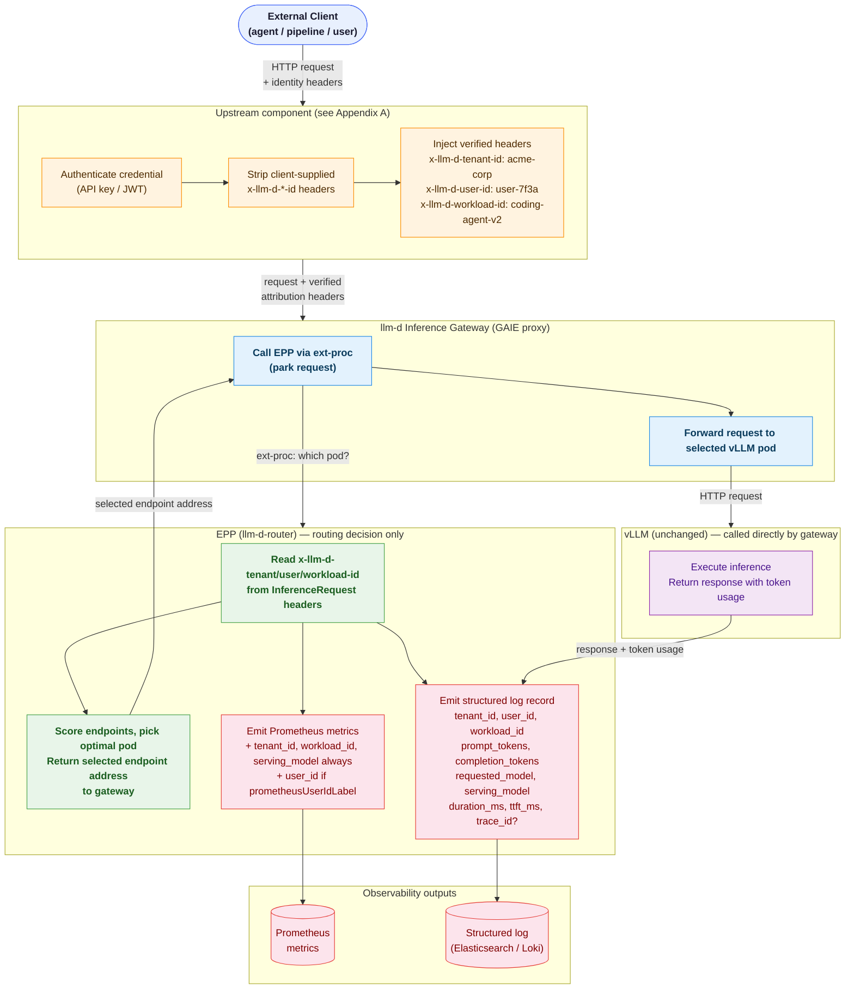
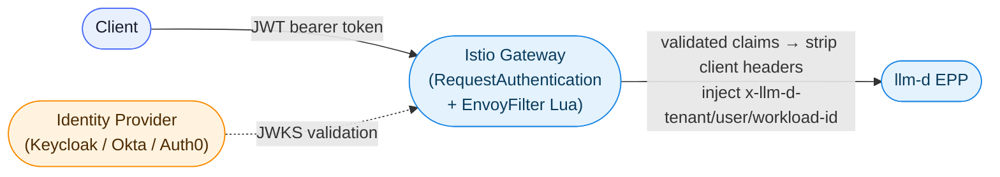
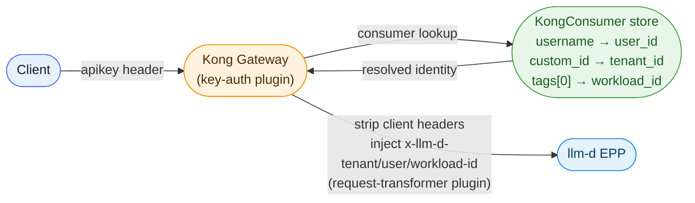
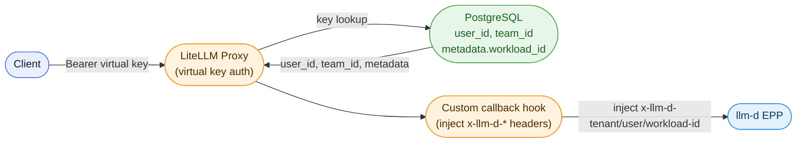

# Request Attribution Metrics

**Authors**: Sima Nadler (_IBM_)

## Summary

llm-d can track token usage and infrastructure cost per model today, but has no
mechanism to attribute those costs to the **business entities** that generate
them: tenants, users, and workloads. This proposal introduces request
attribution — the ability to tag every inference request with a
`tenant_id`, `user_id`, and `workload_id` carried in request headers, and
then propagate those identities through the llm-d observability stack so that:

1. Prometheus metrics carry attribution labels for real-time dashboards,
   alerting, and chargeback.
2. Distributed traces carry attribution span attributes for per-request
   cost audit.
3. A structured JSON log record is emitted per request at completion,
   always including all three identity fields — the authoritative record
   for billing, audit, and per-user attribution when the Prometheus
   `user_id` label is disabled.
4. No changes are required to vLLM or model server code.

How the three values are populated in the headers — whether from an API key
lookup, a JWT, an internal service identity, or any other mechanism — is out
of scope. See [Appendix A](#appendix-a-populating-attribution-headers-in-production)
for a recommended production approach.

## Motivation

The existing llm-d cost tracking stack (OpenCost + vLLM metrics) answers
"what does it cost to serve model X?" It cannot answer:

* Which team or customer is responsible for that cost?
* Which application, agent, or pipeline is driving GPU spend?
* Is a specific user consuming a disproportionate share of shared
  infrastructure?

Without these answers, multi-tenant platform teams cannot do chargeback,
cannot enforce per-tenant budgets, and cannot identify which workloads are
cost-inefficient. The `x-llm-d-inference-fairness-id` header partially
addresses the fairness scheduling concern, but it is a single opaque string
designed for queue isolation — not a structured identity system capable of
expressing all three attribution dimensions simultaneously or supporting
fine-grained cost rollup.

### Goals

* Define three canonical attribution headers:
  `x-llm-d-tenant-id`, `x-llm-d-user-id`, `x-llm-d-workload-id`.
* Add `tenant_id` and `workload_id` as unconditional labels, and `user_id`
  as a configurable label, on EPP token-count and request-volume Prometheus
  metrics so aggregate cost dashboards work without trace queries.
* Emit a structured JSON log record per completed request, always including
  all three identity fields, token counts, model, latency, and namespace —
  the authoritative billing and audit record regardless of Prometheus label
  settings.
* Add the three values as span attributes on the `gateway.request` root span
  so per-request cost audit works via Jaeger/Tempo TraceQL.
* Document the end-to-end setup in `docs/operations/observability/`.

### Non-Goals

* Replacing or deprecating `x-llm-d-inference-fairness-id`. That header
  governs flow-control queue placement and remains unchanged.
* Forwarding attribution headers to vLLM or the P/D sidecar. The EPP sees
  all requests; vLLM-level attribution is not required.
* Implementing or specifying client authentication or authorization. This
  proposal defines what the headers mean and how llm-d uses them. How they
  are populated is left to the operator (see Appendix A for recommendations).
* Per-request payload inspection or body-based routing.
* Real-time budget enforcement or request admission based on spend.
* Log aggregation infrastructure. The structured log record is written to
  the EPP's standard logger; shipping it to a log backend (Elasticsearch,
  Loki, Splunk, etc.) is the operator's responsibility.

### Example Use Cases

* **Workload cost comparison** — an engineering team compares two agent versions side by side to see which costs less per million tokens, directly in dollars, without manual metric calculation.
* **Platform team chargeback** — a platform team running a shared deployment bills internal product teams by querying per-tenant cost breakdowns at the end of each month, covering both what infrastructure was reserved and what was actually consumed.
* **Per-user billing with unbounded users** — a SaaS platform serves thousands of end users and produces per-user invoices by querying a log stream when Prometheus label cardinality makes per-user metrics impractical.
* **Compliance token audit** — a compliance team verifies a service account stayed within its token budget by querying distributed traces filtered by user identity, with full per-request timing context.
* **Shared model pool cost attribution** — a cluster serves multiple tenants from a single model pool; comparing allocation-based vs. usage-based costs per tenant reveals which tenants are over-provisioned relative to actual consumption, informing capacity right-sizing and SLA renegotiation.
* **Cost governance and anomaly detection** — a platform team configures alerts on per-tenant token consumption metrics; when a tenant exceeds its expected monthly budget mid-cycle, an alert fires before the bill arrives, catching runaway agents or misconfigured prompts early.
* **Multi-team capacity planning** — by trending token consumption per `tenant_id` over weeks, a platform team identifies which tenants are growing fastest and pre-provisions capacity proactively rather than reacting to saturation events.
* **A/B model rollout cost comparison** — during a canary rollout of a larger model variant, querying OpenCost by `serving_model` and `workload_id` together shows whether the quality improvement justifies the higher cost per million tokens before the rollout is promoted to production.

## Proposal

### Two Output Tiers

Attribution data is produced at two granularities for two complementary
purposes:

| Tier | Mechanism | Granularity | `user_id` | Primary use case |
|---|---|---|---|---|
| **Tier 1** | EPP Prometheus metric labels | Aggregate | Configurable | Real-time dashboards, alerting, chargeback |
| **Tier 2** | EPP structured JSON log | Per-request, 100% | Always | Complete billing audit, per-user attribution |

**Tier 1 — Prometheus metric labels** are the right tool for questions like
"how many tokens did `acme-corp` consume this hour?" They are fast,
aggregatable, and feed directly into Grafana dashboards and alerting rules.
They are the wrong tool for per-user attribution at scale because adding
`user_id` as a label on high-cardinality deployments causes Prometheus
time-series explosion. The `prometheusUserIdLabel` configuration gate
addresses this.

**Tier 2 — Structured JSON log** is the complete, authoritative attribution
record. It is emitted for **every request**, always includes all three
identity fields and token counts, and carries an optional `trace_id` field
that links to the distributed trace when tracing is enabled — useful for
debugging expensive requests. It is the sole required mechanism for accurate
billing and per-user audit. It is the wrong tool for real-time dashboards —
log aggregation backends (Elasticsearch, Loki) are not designed for the
sub-second query latency that Prometheus/Grafana delivers.

The two tiers are complementary: Tier 1 for operations, Tier 2 for finance
and audit.

### Attribution Headers

Three new request headers are introduced, all in the `x-llm-d-*` namespace:

| Header | Description | Example value |
|---|---|---|
| `x-llm-d-tenant-id` | Identifies the organizational unit responsible for the request (team, customer, department) | `acme-corp` |
| `x-llm-d-user-id` | Identifies the individual end user within the tenant | `user-7f3a` |
| `x-llm-d-workload-id` | Identifies the application, agent, or pipeline submitting the request | `coding-agent-v2` |

All three are optional. Omitted headers result in the literal value `unknown`
in metric labels and span attributes, preserving label cardinality uniformity.

These headers follow the same trust-boundary model as `x-llm-d-inference-fairness-id`
and `x-llm-d-inference-objective`: llm-d reads and trusts them as presented.
In production, they should be stripped from external client requests and
injected by a trusted upstream component (API gateway, identity proxy, or
service mesh policy) based on verified credential data. Clients must never be
permitted to self-assert these values in a production deployment.

> [!WARNING]
> **Trust Boundary**: In a production system, allowing end-users to
> self-assert their tenant, user, or workload identity is an attribution
> integrity risk. In production, these headers should be stripped from
> external requests and injected by an upstream trusted API gateway, identity
> provider, or Envoy AuthZ filter. See
> [Appendix A](#appendix-a-populating-attribution-headers-in-production) for
> recommended approaches.

### EPP Metric Labels (Aggregate Attribution)

The EPP token-count and request-volume metrics gain new labels. `tenant_id`,
`workload_id`, and `serving_model` are bounded sets (organizations, named agents
and pipelines, and deployed model names) and are always safe as Prometheus labels.
`serving_model` is the authoritative model name returned by vLLM in the response
body — the same join key used by OpenCost — and may differ from `model_name` when
a model-selector rewrite is in effect. `user_id` is **conditionally** included
as a label, controlled by EPP configuration, because the requestor population
can be arbitrarily large in public-facing deployments and would cause
cardinality explosion if included unconditionally.

#### Label sets

The current label set on affected metrics:

```
{model_name, target_model_name, fairness_id, priority}
```

With attribution enabled, always includes:

```
{model_name, target_model_name, fairness_id, priority, tenant_id, workload_id, serving_model}
```

When `prometheusUserIdLabel: true` (default), also includes:

```
{model_name, target_model_name, fairness_id, priority, tenant_id, workload_id, serving_model, user_id}
```

#### Configuration

In the EPP configuration:

```yaml
requestAttribution:
  enabled: true
  prometheusUserIdLabel: true   # default: true
                                # set false for deployments with unbounded
                                # end-user populations to avoid cardinality explosion
```

#### Affected metrics

| Metric | Always added | Conditionally added |
|---|---|---|
| `llm_d_epp_request_total` | `tenant_id`, `workload_id`, `serving_model` | `user_id` |
| `llm_d_epp_request_error_total` | `tenant_id`, `workload_id`, `serving_model` | `user_id` |
| `llm_d_epp_request_input_tokens` | `tenant_id`, `workload_id`, `serving_model` | `user_id` |
| `llm_d_epp_request_output_tokens` | `tenant_id`, `workload_id`, `serving_model` | `user_id` |
| `llm_d_epp_request_cached_tokens` | `tenant_id`, `workload_id`, `serving_model` | `user_id` |
| `llm_d_epp_request_duration_seconds` | `tenant_id`, `workload_id`, `serving_model` | `user_id` |

Metrics not related to per-request token attribution (e.g. data layer,
scheduling internals, flow control) are not changed.

The EPP reads the three identity headers from the `InferenceRequest` struct
(which already carries the full header map) in the request handling path,
defaulting to `unknown` when a header is absent. `serving_model` is populated
from the model name returned by vLLM in the response body, defaulting to
`target_model_name` when the response body is unavailable (e.g. on error paths).

> [!WARNING]
> **Cardinality**: Do not enable `prometheusUserIdLabel` for public-facing
> deployments with unbounded end-user populations without first assessing the
> `user_id` cardinality. Bounded requestor populations (service accounts,
> teams, named integrations) are safe. Individual human end-users at scale
> are not. Per-user attribution remains fully available via the structured log
> and distributed traces regardless of this setting.

### Structured Log Record (Per-Request Audit)

A structured JSON record is emitted by the EPP at request completion for
**every request**, regardless of trace sampling rate or Prometheus label
configuration. This is the authoritative billing and audit record.

```json
{
  "level": "info",
  "ts": "2025-07-01T14:23:01.123Z",
  "logger": "epp.attribution",
  "msg": "request.complete",
  "tenant_id": "acme-corp",
  "user_id": "user-7f3a",
  "workload_id": "coding-agent-v2",
  "requested_model": "Qwen3-32B",
  "serving_model": "Qwen3-32B",
  "namespace": "llm-d",
  "prompt_tokens": 128,
  "completion_tokens": 512,
  "cached_tokens": 64,
  "duration_ms": 2150,
  "ttft_ms": 55,
  "request_id": "req-abc123",
  "trace_id": "4bf92f3577b34da6a3ce929d0e0e4736"
}
```

The structured log record:

* **Always includes `user_id`**, even when `prometheusUserIdLabel: false` —
  making it the authoritative path for per-user billing and audit in
  deployments with unbounded requestor populations.
* **Includes `trace_id`** when distributed tracing is enabled, linking the
  log record to the full end-to-end trace in Jaeger or Tempo. When tracing
  is not enabled, `trace_id` is omitted. This makes Tier 2 a superset of
  Tier 3: the log is the complete attribution record; the trace is on-demand
  latency detail for the subset of requests that were sampled.
* Is emitted at `INFO` level on the `epp.attribution` logger, which can be
  independently configured (e.g. routed to a separate sink) without changing
  the EPP's general log level.
* Distinguishes `requested_model` from `serving_model`: `requested_model` is
  the value from the request body before any model-rewrite; `serving_model` is
  the authoritative value returned by vLLM in the response body — the same
  join key used by OpenCost.
* Does **not** include request or response body content — metadata only.

## Design Details

### Architecture



### Output tiers summary

| Tier | Mechanism | Granularity | `user_id` | Use case |
|---|---|---|---|---|
| **Tier 1** | Prometheus metric labels | Aggregate | Configurable | Dashboards, alerting, chargeback |
| **Tier 2** | Structured JSON log | Per-request, 100% | Always | Billing audit, per-user attribution at scale |

### OpenCost Billing Queries

The attribution labels emitted by the EPP are consumed by OpenCost to produce
per-`tenant_id`, per-`workload_id`, and per-`user_id` cost breakdowns alongside
the existing per-model cost tracking. See
[`open-cost-new-dimensions-plan.md`](open-cost-new-dimensions-plan.md) for the
full OpenCost implementation plan.

`llm_d_epp_request_input_tokens` and `llm_d_epp_request_output_tokens` are
**histograms**. Prometheus histograms expose a `_sum` series that accumulates
the sum of all observed values and behaves as a monotonically increasing
counter. OpenCost computes per-window token totals using the standard
`last_over_time` delta pattern against these `_sum` series — no separate
`_total` counter metrics are needed:

```promql
-- input tokens consumed by tenant in a billing window
  sum by (tenant_id, serving_model, namespace) (
    last_over_time(llm_d_epp_request_input_tokens_sum[<window>m] @ <end_unix>)
  )
- sum by (tenant_id, serving_model, namespace) (
    last_over_time(llm_d_epp_request_input_tokens_sum[2m] @ <start_unix>)
  )
```

The same pattern applies to `llm_d_epp_request_output_tokens_sum`. The
attribution labels (`tenant_id`, `workload_id`, `serving_model`, and
optionally `user_id`) are present on all histogram series — `_bucket`,
`_count`, and `_sum` — so the `_sum` delta query naturally carries the full
attribution context needed for chargeback.

### Changes by Repository

| Repository | Change |
|---|---|
| `llm-d/llm-d-router` | Request handling path: extract three headers; add as Prometheus labels (with `prometheusUserIdLabel` config gate on `user_id`); emit structured JSON completion record via `epp.attribution` logger |
| `llm-d/llm-d` | New doc `docs/operations/observability/attribution.md`; update `docs/api-reference/epp-http-headers.md`; update tracing and metrics docs; add example PromQL queries to `docs/operations/observability/promql.md` |
| `opencost/opencost` | Consume `llm_d_epp_request_input_tokens_sum` and `llm_d_epp_request_output_tokens_sum` with attribution labels to produce per-`tenant_id`/`workload_id`/`user_id` cost breakdowns — see [`open-cost-new-dimensions-plan.md`](open-cost-new-dimensions-plan.md) |

### Fallback Behaviour

If a header is absent (e.g. internal health-check traffic, or a deployment
that has not yet configured header injection):

* Metric labels default to `unknown`
* Span attributes are set to `unknown`
* Structured log fields default to `unknown`
* No request is rejected; attribution is best-effort and degrades gracefully

### Security

The three headers follow the same trust model as the existing
`x-llm-d-inference-fairness-id` header. llm-d reads them as trusted input;
it does not validate or re-derive them. Operators are responsible for ensuring
that only trusted upstream components can set these headers before requests
reach the llm-d inference gateway.

The trust boundary requirement and recommended mitigations are documented in
the header reference and in Appendix A.

### Example User Stories — Implementation Approaches

#### Story 1: Workload cost comparison

An engineering team runs two coding agents (`coding-agent-v1` and
`coding-agent-v2`) and wants to compare their inference costs. The EPP labels
all token metrics with `workload_id`; OpenCost aggregates these into per-workload
costs. The team calls the OpenCost inference cost API
(`GET /inferencecost?aggregate=workload_id&filter=workload_id:"coding-agent-v1",workload_id:"coding-agent-v2"&window=week`)
and sees that `coding-agent-v2` costs 30% less per million tokens due to
improved context pruning in its system prompt — expressed directly in dollars
rather than requiring manual token-to-cost conversion in Grafana.

#### Story 2: Platform team chargeback

A platform team runs a shared llm-d deployment serving three internal product
teams. An upstream API gateway injects `x-llm-d-tenant-id` for every request
based on the caller's credential. The EPP emits `llm_d_epp_request_input_tokens`
and `llm_d_epp_request_output_tokens` with the `tenant_id` label; OpenCost
aggregates these into per-tenant allocation and usage costs. At the end of the
month, the platform team calls the OpenCost inference cost API
(`GET /inferencecost?aggregate=tenant_id&window=month`) to retrieve a
per-tenant cost breakdown — both allocation-based and usage-based — and
produces an internal chargeback report without writing any custom collection code.

#### Story 3: Per-user billing audit with unbounded users

A SaaS platform serves thousands of individual end users. The operator has
set `prometheusUserIdLabel: false` to avoid Prometheus cardinality explosion.
For tenant-level costs, the billing team calls the OpenCost inference cost API
(`GET /inferencecost?aggregate=tenant_id&window=month`) as normal. For
per-user invoice breakdown, where Prometheus labels are disabled, the billing
team queries the EPP's structured log stream (shipped to Elasticsearch) for all
records with `tenant_id = "acme-corp"`, groups by `user_id`, and sums
`prompt_tokens` and `completion_tokens` — without any trace infrastructure
required.

#### Story 4: Per-user token audit via traces

A compliance team needs to verify that a specific low-volume service account's
requests on a given day stayed within a token budget. Because the EPP adds
`llm_d.user_id`, `llm_d.tenant_id`, and `llm_d.workload_id` as span attributes
on the `gateway.request` root span, the team can query Jaeger directly with
`llm_d.user_id = "svc-audit"` and retrieve all traces for that account. Each
trace's `vllm:llm_request` span carries `gen_ai.usage.prompt_tokens` and
`gen_ai.usage.completion_tokens`, giving exact per-request token counts with
full timing and latency context — without requiring a log aggregation backend
or a billing query.

## Alternatives

### Use `x-llm-d-inference-fairness-id` as a composite key

A single `fairness-id` value like `acme-corp:user-7f3a:coding-agent` could
encode all three dimensions. This requires no new headers or EPP changes.

**Rejected**: A composite key cannot be disaggregated in Prometheus label
matchers without regex. Separate labels allow clean aggregation by any single
dimension (e.g. all tenants regardless of user or workload). The composite key
also conflates a scheduling concern (queue fairness) with a reporting concern
(cost attribution), making both harder to evolve independently.

### Derive attribution from vLLM metrics alone

vLLM's `llm_request` span carries token counts. If the upstream gateway
records `{trace-id → tenant, user, workload}` in a side-store, a Tempo
TraceQL join could reconstruct per-tenant token usage from traces alone.

**Rejected for aggregate use cases**: Traces are not designed for high-volume
metric aggregation. Prometheus + metric labels is the right tool for
dashboards, alerting, and chargeback. Traces remain the right tool for
per-request audit, and this proposal uses them for that purpose.

### Implement in the P/D sidecar or vLLM

Attribution could be captured at the model server level by reading headers
forwarded from the EPP.

**Rejected**: The EPP sees 100% of requests and is the natural aggregation
point. vLLM should remain a generic inference engine with no llm-d-specific
attribution logic. The P/D sidecar operates at the transfer coordination layer,
not the request attribution layer.

---

## Appendix A: Populating Attribution Headers in Production

This appendix describes recommended approaches for populating the three
attribution headers before requests reach the llm-d inference gateway. The
core proposal is agnostic to this mechanism; the options below are informative
rather than prescriptive.

### Current state of llm-d authentication

The current llm-d gateway guides and recipes contain **no client
authentication**. Every well-lit path guide sends inference requests directly
to the gateway IP with no API key, no JWT, and no bearer token. The only
credential in a standard llm-d deployment is a HuggingFace token used at pod
startup to pull model weights — it plays no role in request-time identity.

The two optional external API proxy integration guides
([Kong](../../docs/operations/serve-external-apis/kong.md),
[LiteLLM](../../docs/operations/serve-external-apis/litellm.md)) introduce
client authentication, but neither injects identity headers into the requests
forwarded to the llm-d inference gateway.

Adding attribution header injection requires an upstream component to be
configured. The options below cover the most common patterns.

### Common pattern

Regardless of the credential type or upstream component chosen, the injection
pattern is the same:

```mermaid
flowchart LR
    classDef client   fill:#e8f0fe,stroke:#4a6cf7,color:#1a1a2e,font-weight:bold
    classDef cred     fill:#fff3e0,stroke:#fb8c00,color:#4e2b00
    classDef action   fill:#e8f5e9,stroke:#43a047,color:#1b5e20
    classDef header   fill:#fce4ec,stroke:#e53935,color:#7f0000,font-weight:bold
    classDef gw       fill:#e3f2fd,stroke:#1e88e5,color:#0b3c5d,font-weight:bold

    Client(["Client\n(agent / user / pipeline)"]):::client
    Cred(["Credential\n(API key or JWT)"]):::cred

    subgraph upstream["Upstream component  (Kong / LiteLLM / Istio / Envoy AuthZ)"]
        Validate["1. Validate credential"]:::action
        Lookup["2. Resolve identity\ntenant_id, user_id, workload_id"]:::action
        Strip["3. Strip client-supplied\nx-llm-d-*-id headers"]:::action
        Inject["4. Inject verified headers"]:::action
        Validate --> Lookup --> Strip --> Inject
    end

    Headers["x-llm-d-tenant-id: acme-corp\nx-llm-d-user-id: user-7f3a\nx-llm-d-workload-id: coding-agent-v2"]:::header

    GW(["llm-d Inference Gateway\n→ EPP → vLLM"]):::gw

    Client -->|"request + credential"| upstream
    Cred -. "bound to credential store\nor JWT claims" .-> Lookup
    Inject --> Headers
    Headers -->|"trusted request"| GW
```



Steps 1–4 are the responsibility of the upstream component. The llm-d
inference gateway and EPP trust the headers as presented and do not
re-validate them. The three options below differ only in how Step 2
(identity resolution) is performed.

### Option 1: JWT from an identity provider (recommended)

JWT with custom claims from a proper identity provider (Keycloak, Okta, Auth0,
or similar) is the cleanest option. All three dimensions are first-class,
separately addressable fields defined at token issuance time — no operator
convention required.

**Native field support**:

| Dimension | JWT claim | Notes |
|---|---|---|
| `tenant_id` | Custom claim (e.g. `tenant_id`) | Defined at issuance by the IdP |
| `user_id` | `sub` or custom claim | `sub` is standard; custom claim preferred for stability |
| `workload_id` | Custom claim (e.g. `workload_id`) | Defined at issuance by the IdP |

**Example JWT payload**:

```json
{
  "sub": "user-7f3a",
  "tenant_id": "acme-corp",
  "workload_id": "coding-agent-v2",
  "exp": 1893456000
}
```

**Flow**:



**Injection with Istio** (validate JWT then extract claims via EnvoyFilter):

```yaml
# Step 1: Validate the JWT — Istio stores the verified payload in dynamic metadata
apiVersion: security.istio.io/v1beta1
kind: RequestAuthentication
metadata:
  name: llm-d-jwt-authn
spec:
  selector:
    matchLabels:
      app: llm-d-inference-gateway
  jwtRules:
    - issuer: "https://your-idp.example.com"
      jwksUri: "https://your-idp.example.com/.well-known/jwks.json"
      forwardOriginalToken: true
---
# Step 2: Extract verified claims → x-llm-d-* headers via Lua filter
# This runs after JWT validation, so payload fields are trusted.
apiVersion: networking.istio.io/v1alpha3
kind: EnvoyFilter
metadata:
  name: inject-attribution-headers
spec:
  configPatches:
    - applyTo: HTTP_FILTER
      match:
        context: GATEWAY
      patch:
        operation: INSERT_BEFORE
        value:
          name: envoy.filters.http.lua
          typed_config:
            "@type": type.googleapis.com/envoy.extensions.filters.http.lua.v3.LuaPerRoute
            inline_code: |
              function envoy_on_request(request_handle)
                -- Strip any client-supplied attribution headers (trust boundary)
                request_handle:headers():remove("x-llm-d-tenant-id")
                request_handle:headers():remove("x-llm-d-user-id")
                request_handle:headers():remove("x-llm-d-workload-id")
                -- Inject from verified JWT payload stored in dynamic metadata
                local meta = request_handle:streamInfo():dynamicMetadata()
                local jwt = meta:get("envoy.filters.http.jwt_authn") or {}
                local payload = jwt["payload"] or {}
                request_handle:headers():add(
                  "x-llm-d-tenant-id", payload["tenant_id"] or "unknown")
                request_handle:headers():add(
                  "x-llm-d-user-id", payload["sub"] or "unknown")
                request_handle:headers():add(
                  "x-llm-d-workload-id", payload["workload_id"] or "unknown")
              end
```

The same extraction pattern applies to agentgateway, Envoy AI Gateway, and
any other GAIE-conformant proxy that supports header manipulation after JWT
validation.

### Option 2: Kong API key

**Flow**:




Kong's `KongConsumer` object has no dedicated fields for all three dimensions.
They must be encoded using the fields that do exist:

| Attribution dimension | Kong field | Constraint |
|---|---|---|
| `tenant_id` | `custom_id` on `KongConsumer` | Single opaque string; set at consumer creation |
| `user_id` | `username` on `KongConsumer` | Single string; set at consumer creation |
| `workload_id` | `tags[0]` by convention | No dedicated field; free-form string array |

Provision consumers with explicit values for each field:

```bash
kubectl apply -n kong -f - <<EOF
apiVersion: v1
kind: Secret
metadata:
  name: acme-rag-key
  labels:
    konghq.com/credential: key-auth
stringData:
  key: "sk-$(openssl rand -hex 16)"
---
apiVersion: configuration.konghq.com/v1
kind: KongConsumer
metadata:
  name: acme-coding-agent
  annotations:
    kubernetes.io/ingress.class: kong
username: user-7f3a          # → x-llm-d-user-id
custom_id: acme-corp         # → x-llm-d-tenant-id
tags:
  - coding-agent-v2          # → x-llm-d-workload-id (tags[0] by convention)
credentials:
  - acme-rag-key
EOF
```

After `key-auth` resolves the consumer, use a `request-transformer` plugin to
strip client-supplied values and inject from the consumer fields:

```yaml
apiVersion: configuration.konghq.com/v1
kind: KongPlugin
metadata:
  name: inject-attribution-headers
plugin: request-transformer
config:
  remove:
    headers:
      - x-llm-d-tenant-id     # strip any client-supplied value first
      - x-llm-d-user-id
      - x-llm-d-workload-id
  add:
    headers:
      - "x-llm-d-tenant-id:$(consumer.custom_id)"
      - "x-llm-d-user-id:$(consumer.username)"
      - "x-llm-d-workload-id:$(consumer.tags[0])"
```

> **Note**: `$(consumer.tags[0])` injection is not supported in all Kong
> versions. An alternative is to encode all three dimensions as a structured
> `custom_id` (e.g. `acme-corp|user-7f3a|coding-agent`) and parse it in a
> `pre-function` Lua plugin. JWT is strongly preferred when all three
> dimensions are needed independently.

### Option 3: LiteLLM virtual key

**Flow**:




LiteLLM has a native `user_id` field and a `team_id` concept (Teams feature)
for tenant grouping, but no dedicated `workload_id` field. The `metadata` dict
on a key can carry arbitrary structured data:

```bash
curl -s http://litellm:4000/key/generate \
  -H "Authorization: Bearer $MASTER_KEY" \
  -H "Content-Type: application/json" \
  -d '{
    "user_id": "user-7f3a",
    "team_id": "acme-corp",
    "metadata": { "workload_id": "coding-agent-v2" },
    "models": ["qwen/qwen3-32B"],
    "max_budget": 10.0,
    "duration": "30d"
  }'
```

| Attribution dimension | LiteLLM field | Notes |
|---|---|---|
| `tenant_id` | `team_id` (Teams feature) | Requires LiteLLM Teams tier |
| `user_id` | Native `user_id` on `/key/generate` | First-class; tracked in PostgreSQL spend reports |
| `workload_id` | `metadata` dict | No dedicated field; arbitrary JSON |

LiteLLM does not natively inject HTTP headers into forwarded requests based on
key metadata. A [custom callback hook](https://docs.litellm.ai/docs/proxy/call_hooks)
is required to read the resolved key context and inject the `x-llm-d-*`
headers before forwarding to llm-d.

> **Note**: LiteLLM already tracks spend per `user_id` and `team_id` in its
> PostgreSQL backend. If LiteLLM sits in front of llm-d, its own spend
> tracking may be sufficient for chargeback without needing the `x-llm-d-*`
> headers — those are only needed if you also want attribution in llm-d's
> Prometheus metrics or distributed traces independently of LiteLLM's database.
