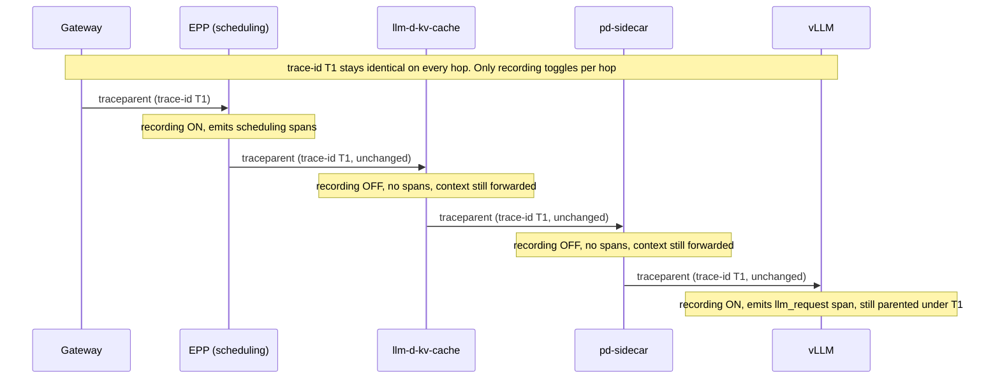
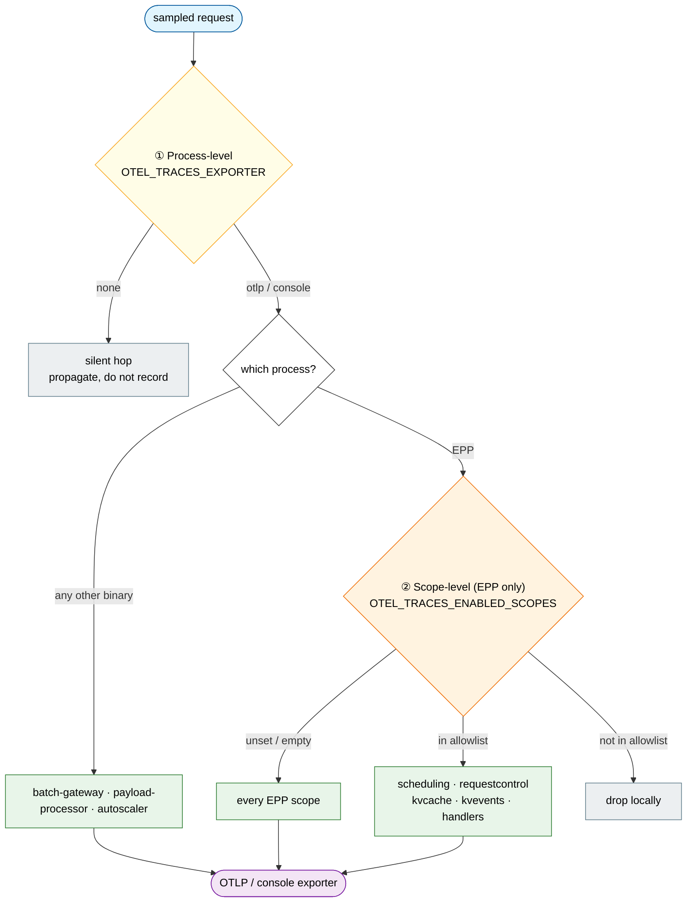
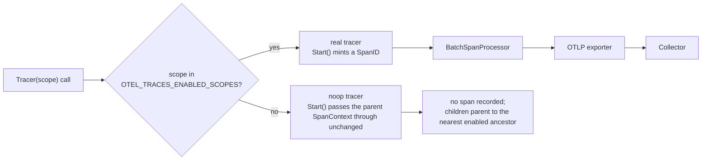

# Selective Tracing for llm-d

## Summary

[Distributed Tracing for llm-d](distributed-tracing.md) established end-to-end OpenTelemetry tracing across the request path, correlated by W3C trace context and controlled by a single stack-wide sampling ratio (`OTEL_TRACES_SAMPLER_ARG`, default 10%). That work is implemented and documented in [Distributed Tracing](../docs/operations/observability/tracing.md).

This proposal adds a second, orthogonal control: **which components actually record and export spans**, independent of which requests get sampled.

What exists today:

* Process-level on/off is documented only in [Distributed Tracing](../docs/operations/observability/tracing.md), and only for three components, each through a different mechanism:
  * vLLM / SGLang: kustomize container args (`--otlp-traces-endpoint`) plus `OTEL_*` env vars ([Step 2](../docs/operations/observability/tracing.md#step-2-enable-tracing-on-the-model-server-and-routing-proxy))
  * Routing proxy (pd-sidecar): the same `OTEL_*` env vars on the sidecar container ([Step 2](../docs/operations/observability/tracing.md#step-2-enable-tracing-on-the-model-server-and-routing-proxy))
  * EPP: GAIE Helm `inferenceExtension.tracing` ([Step 3](../docs/operations/observability/tracing.md#step-3-enable-tracing-on-epp))
* Inside EPP, tracing is all-or-nothing for the whole process, even though EPP bundles several independently-instrumented subsystems (scheduling, request control, KV-cache indexing, KV events).
* Four other instrumented components each bootstrap tracing independently, with no shared convention: `llm-d-kv-cache` (standalone), `llm-d-batch-gateway`, `llm-d-inference-payload-processor`, `llm-d-workload-variant-autoscaler`.

What this proposal keeps and adds:

* Trace-context propagation stays on end to end, regardless of which components are recording.
* Operators can turn tracing on for a subset of components, down to individual subsystems inside a single process where useful, and still get correlated traces rather than isolated fragments.

## Motivation

The cost of tracing every hop on every sampled request grows as more components and EPP plugins gain instrumentation:

* Per-request overhead is paid in every instrumented component, not just at the sampler.
* Collector and backend storage cost scale with the number of instrumented hops per sampled request, even at the current 10% default.
* Traces get noisier than necessary: a request-level trace that includes every EPP plugin obscures the two or three spans someone investigating a KV-cache regression actually needs.

Component-level control is also inconsistent today:

* `docs/operations/observability/tracing.md` documents three knobs (vLLM/SGLang container env vars, routing-proxy container env vars, and the GAIE `inferenceExtension.tracing` Helm values for EPP).
* Those knobs only cover the inference request path shipped from `llm-d/llm-d`.
* Four other repos (`llm-d-kv-cache`, `llm-d-batch-gateway`, `llm-d-inference-payload-processor`, `llm-d-workload-variant-autoscaler`) each reimplement `InitTracing` with divergent config surfaces.
* `llm-d-workload-variant-autoscaler` and `llm-d-router` both implement `OTEL_TRACES_EXPORTER=none|otlp|console` as a clean per-process on/off switch, but their defaults disagree: WVA defaults to `none`, `llm-d-router` defaults to `otlp`. `llm-d-kv-cache`, `llm-d-batch-gateway`, and `llm-d-inference-payload-processor` have not converged on this convention at all.
* There is no documented guarantee that a component left "off" still propagates incoming trace context. Without that, spans from a downstream component that *is* on would not correlate back to the originating request.

EPP has the same gap one level down. Scheduling, request control, KV-cache indexing, and KV events already create spans under distinct OpenTelemetry instrumentation scopes (`TracerScope` constants such as `llm-d-router/pkg/epp/scheduling`, `llm-d-router/pkg/kvcache`, `llm-d-router/pkg/kvevents`, `llm-d-router/pkg/epp/framework/plugins/requestcontrol`), but they all run in one process behind one `TracerProvider`, so there is no way to enable one and suppress another.

### Goals

* Establish and document a single contract used by every component: trace-context propagation is always active end to end, independent of whether that component records or exports spans.
* Converge the five repos' independently-implemented `InitTracing` functions on one shared configuration convention (`OTEL_TRACES_EXPORTER=none|otlp|console`, following `llm-d-workload-variant-autoscaler`'s existing implementation as the reference), giving every component process-level, deploy-time on/off control, consistent with how EPP, vLLM, and the routing proxy are already controlled today.
* Add finer, subsystem-level control inside the EPP process, using the instrumentation-scope names the code already assigns (`TracerScope`), so an operator can enable tracing for, say, KV-cache and KV-events spans without also recording scheduling and request-control spans.
* Update `docs/operations/observability/tracing.md` (and add coverage for the four components it currently omits) once the convention lands, so it stays the single operator-facing reference.

### Non-Goals

* A new control plane, CRD, or admin API for toggling tracing at runtime without a redeploy. Static, deploy-time configuration (Helm values / kustomize env vars) is sufficient for this proposal; a live-reloadable toggle is a possible follow-up if static configuration proves insufficient in practice, not something this proposal commits to building.
* Changing vLLM's own tracing behavior: it is upstream, controlled by `--otlp-traces-endpoint`, and out of scope here as it was in the original distributed-tracing proposal.
* Changing the default sampling ratio or sampling strategy (`OTEL_TRACES_SAMPLER_ARG`). That controls which *requests* are sampled; this proposal is about which *components* record spans for a request that has already been sampled in.
* Per-request forced tracing (e.g. a debug header or baggage key that forces one specific request to be fully recorded regardless of the sampling ratio). This is a natural complement to component-level selection and the design below leaves room for it, but it is not part of this proposal's scope and should be filed as a separate follow-up if wanted.
* Selective collection for metrics or logs. Consistent with the original distributed-tracing proposal, this is tracing-only.

## Proposal

The contract this proposal introduces is: **propagation is global, recording is selective.**

Every component continues to install the W3C `TraceContext`/`Baggage` propagator unconditionally, before it checks whether its own span recording is enabled. A component with recording off still extracts the incoming trace context and injects it into any outgoing call, so it does not break the chain; it just does not contribute its own spans to it. This works with OpenTelemetry's existing semantics without any new propagation code: a no-op `TracerProvider`'s `Start()` still returns the parent `SpanContext` unchanged (same trace ID, no new span ID, not recording), so whatever a "silent" component forwards downstream still carries the correct trace ID and parent span ID.



KV cache and pd-sidecar are silent in this example, but the resulting trace is still one correlated tree under `T1`: EPP's scheduling spans and vLLM's `llm_request` span both belong to it, they just have no sibling spans from the two components in between.

On top of that, two levels of "selective" are addressed:

1. **Process-level selection** (which component processes record spans at all). This is what `docs/operations/observability/tracing.md` already documents for vLLM, the routing proxy, and EPP. This proposal extends the same idea, using `llm-d-workload-variant-autoscaler`'s existing `OTEL_TRACES_EXPORTER=none|otlp|console` convention as the reference implementation, to `llm-d-kv-cache` (standalone service mode), `llm-d-batch-gateway`, `llm-d-inference-payload-processor`, and `llm-d-router`'s `coordinator` binary. No new API is needed; this is a matter of aligning existing bootstrap code and Helm/kustomize values.

2. **Scope-level selection within a single process** (which subsystems inside one already-enabled process record spans). This only matters where one binary hosts multiple independently-instrumented subsystems, which today means EPP. Scheduling, request control, KV-cache indexing, and KV events already tag every span with a distinct OpenTelemetry instrumentation scope name via the existing `TracerScope` constants, so this is additive filtering on top of information the code already produces, not a new instrumentation effort.



### User Stories

#### Story 1: Debugging a KV-cache regression

An SRE suspects a regression in prefix-cache hit rate. They want `llm_d.kv_cache.*` and `llm_d.epp.scorer.prefix_cache` spans in detail, without the scheduling and request-control spans that would otherwise dominate the trace view for the same requests, and without turning on tracing in vLLM or the routing proxy, which are not implicated. Today they cannot do this: enabling EPP tracing turns on every plugin's spans at once.

#### Story 2: Batch-workload operator

An operator running `llm-d-batch-gateway` only cares about batch-job spans (`batch.id`, `tenant.id`, job progress). Today, `docs/operations/observability/tracing.md` does not mention this component at all, and its `InitTracing` implementation has its own bespoke configuration surface, so the operator has to reverse-engineer how to turn tracing on and cannot follow the same guide used for the rest of the stack.

#### Story 3: Cost-conscious production, incident response

A production deployment keeps tracing off (or heavily sampled) everywhere by default to control overhead and storage cost. During an active incident, the on-call engineer wants to turn on tracing for just the router and kv-cache hop, without touching vLLM, the routing proxy, or the batch/payload-processor components not implicated in the incident, and without a change that requires re-deploying components outside the ones they are investigating.

## Design Details

### Shared configuration convention

Every component's `InitTracing` reads the same environment variables, matching `llm-d-workload-variant-autoscaler`'s existing implementation:

```bash
OTEL_TRACES_EXPORTER=none        # none (default) | otlp | console
OTEL_EXPORTER_OTLP_ENDPOINT=http://otel-collector:4317
OTEL_TRACES_SAMPLER=parentbased_traceidratio
OTEL_TRACES_SAMPLER_ARG=0.1
```

`OTEL_TRACES_EXPORTER=none` installs the OpenTelemetry no-op `TracerProvider` for that process (no exporter, no batching, spans are non-recording), while the propagator is still installed unconditionally so incoming trace context still flows through and out to the next hop. This is already `llm-d-workload-variant-autoscaler`'s behavior; the other four repos should converge on it so the same three environment variables work the same way everywhere, and the same `docs/operations/observability/tracing.md` guide can cover all of them.

### Scope-level filtering inside EPP

A new environment variable, `OTEL_TRACES_ENABLED_SCOPES`, takes a comma-separated allowlist of instrumentation-scope names. Empty (the default) means all scopes are recorded, preserving current behavior.

```bash
OTEL_TRACES_ENABLED_SCOPES=llm-d-router/pkg/kvcache,llm-d-router/pkg/kvevents
```

This is implemented at tracer acquisition, in `llm-d-router`'s existing `Tracer(scope ...string)` helper (`pkg/common/observability/tracing/telemetry.go`), the single place every subsystem already goes through to get its `trace.Tracer`. A disabled scope gets a no-op `trace.Tracer` instead of one backed by the real `TracerProvider`:

```go
func Tracer(scope ...string) trace.Tracer {
    name := instrumentationName
    if len(scope) > 0 && scope[0] != "" {
        name = scope[0]
    }
    if !scopeEnabled(name) {
        return noop.NewTracerProvider().Tracer(name)
    }
    return otel.Tracer(name, /* ... existing options ... */)
}
```

Filtering here, rather than in a `SpanProcessor.OnEnd`, matters for correctness, not just efficiency. `tracer.Start()` mints a span's `SpanID` at creation time; anything a disabled-scope tracer starts would still hand out a real `SpanID` for its children to record as their parent, and a `SpanProcessor` filtering later at `OnEnd` can only decide whether that already-minted span is exported, not un-mint the `SpanID` its children already captured. A child from an *enabled* scope started under a *disabled* parent would then export with a `parent_span_id` that never arrives at the collector: an orphaned span, detached from the trace tree (or rendered as the root of a spurious new one), in whichever scope happens to sit downstream of a disabled one in the call graph — scheduling and request-control sit upstream of kv-cache and kv-events, so this is not a corner case for EPP's own subsystem tree.

Filtering at acquisition avoids this because the OpenTelemetry API's no-op `Tracer.Start()` (`go.opentelemetry.io/otel/trace/noop`) never mints a new `SpanID` in the first place: given a context that already carries a valid `SpanContext`, it returns that same `SpanContext` unchanged, wrapped as a non-recording span. So a disabled scope's `Start()` is a pass-through: nothing it creates is ever a parent for anything, and any enabled-scope descendant threads back to the nearest enabled ancestor's real span instead. This is the same trick the process-level `OTEL_TRACES_EXPORTER=none` path already relies on (a no-op `TracerProvider` for the whole process); this section applies it per scope instead of per process.



The instrumentation-scope names already exist in the codebase as `TracerScope` constants and do not need to be introduced:

| Subsystem | Scope name |
|---|---|
| KV events | `llm-d-router/pkg/kvevents` |
| KV cache | `llm-d-router/pkg/kvcache` |
| KV cache block index | `llm-d-router/pkg/kvcache/kvblock` |
| Scheduling | `llm-d-router/pkg/epp/scheduling` |
| Scheduling plugins | `llm-d-router/pkg/epp/framework/plugins/scheduling` |
| Request control plugins | `llm-d-router/pkg/epp/framework/plugins/requestcontrol` |
| Request control (director) | `llm-d-router/pkg/epp/requestcontrol` |
| EPP handlers | `llm-d-router/pkg/epp/handlers` |
| Sidecar proxy | `llm-d-router/pkg/sidecar/proxy` |

This is scoped to EPP because it is the one binary that currently hosts this many independently-instrumented subsystems in a single `TracerProvider`. `pd-sidecar` and `coordinator` are separate binaries and already get independent control at the process level; they do not need scope-level filtering unless a future subsystem split makes that necessary.

### Per-repo work

* **llm-d-router**: already implements `OTEL_TRACES_EXPORTER=none|otlp|console` (`pkg/common/observability/tracing/telemetry.go`), with the propagator installed unconditionally so propagation survives `OTEL_TRACES_EXPORTER=none`. Its default is `otlp`, not `none`; reconcile that with this proposal's default before treating the two conventions as aligned. Remaining work is adding `OTEL_TRACES_ENABLED_SCOPES` handling to the `Tracer()` helper, scoped to the EPP binary (`cmd/epp`); no change needed for `cmd/pd-sidecar`, which already gets independent process-level control.
* **llm-d-kv-cache**: align the standalone service's config surface (`pkg/telemetry/tracing.go`) with `OTEL_TRACES_EXPORTER`; confirm the same propagation guarantee; document how the embedded-in-router case (which uses the router's global `TracerProvider` instead of this package) relates to the new scope-level control.
* **llm-d-batch-gateway**: align `internal/util/otel/otel.go` with `OTEL_TRACES_EXPORTER`; confirm propagation from the API server through to the batch processor worker.
* **llm-d-inference-payload-processor**: align `pkg/common/observability/tracing/telemetry.go` with `OTEL_TRACES_EXPORTER`; today it unconditionally defaults `OTEL_EXPORTER_OTLP_ENDPOINT` to `http://localhost:4317` when unset, which should be revisited so the component defaults to off rather than assuming a local collector is present.
* **llm-d-workload-variant-autoscaler**: no functional change; its existing `internal/tracing/tracing.go` becomes the documented reference implementation for the other repos. Separately worth deciding and documenting: whether WVA's optimization-cycle spans should ever be correlated with an inference-request trace, or are intentionally an independent trace tree; this affects whether propagation applies to it the same way.
* **llm-d (this repo)**: once the above lands, extend `docs/operations/observability/tracing.md` with the four components it currently omits and the new `OTEL_TRACES_ENABLED_SCOPES` knob for EPP.

## Alternatives

**A new control plane / CRD for live tracing toggles.** Would let an operator flip tracing on and off without a redeploy, using a custom `Sampler` backed by a value that updates without restarting the process (an in-memory flag refreshed from a watched ConfigMap, for example). Rejected for this proposal because it is a materially larger surface (a watcher, a new API, failure modes when the control signal is unreachable) for a need that static, deploy-time configuration already covers for the scenarios in the user stories above. Worth revisiting as a follow-up if the static approach turns out to be too slow to react to in practice (e.g., the incident-response story above requiring a rollout each time is judged unacceptable once tried).

**Auto-instrumentation agents per component**, rejected in the original distributed-tracing proposal for the same reason it is rejected here: generic HTTP/gRPC spans cannot express llm-d-specific decisions (which scorer ran, why P/D disaggregation was or wasn't used, cache hit ratios), which is the entire value of this stack's manual instrumentation.

**Sample everything, filter downstream in the collector or backend** (e.g., an OpenTelemetry Collector processor or Jaeger/Tempo query-time filtering by scope). This does give an operator a way to *view* only the spans they care about, but every component still pays the cost of creating, batching, and exporting every span for every sampled request, which is exactly the overhead this proposal is meant to avoid. It remains useful as a complementary, ad hoc technique once data has already landed in the backend, but should not be the primary mechanism.
